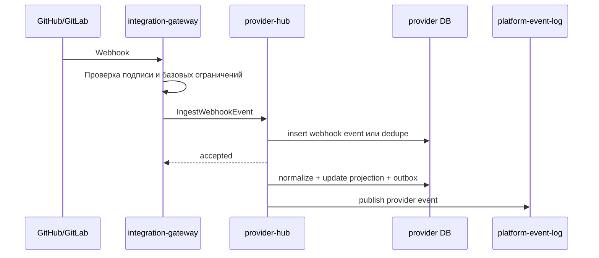
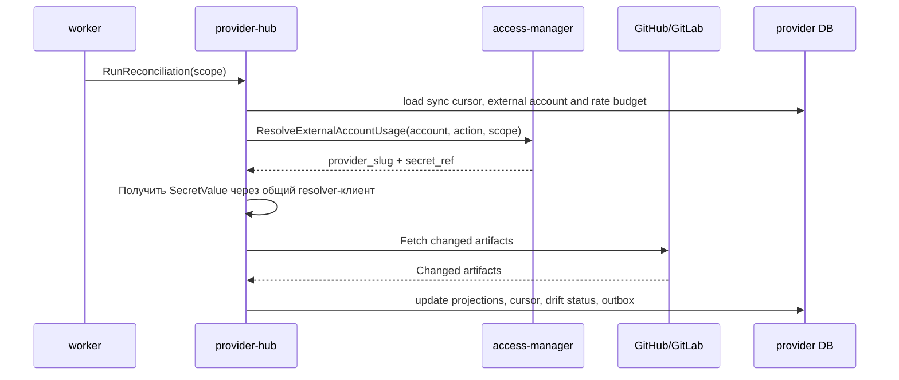
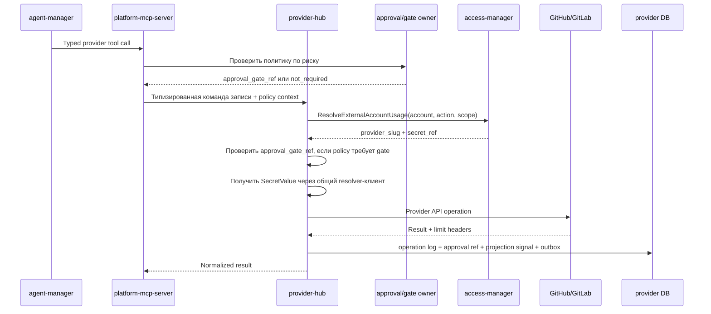
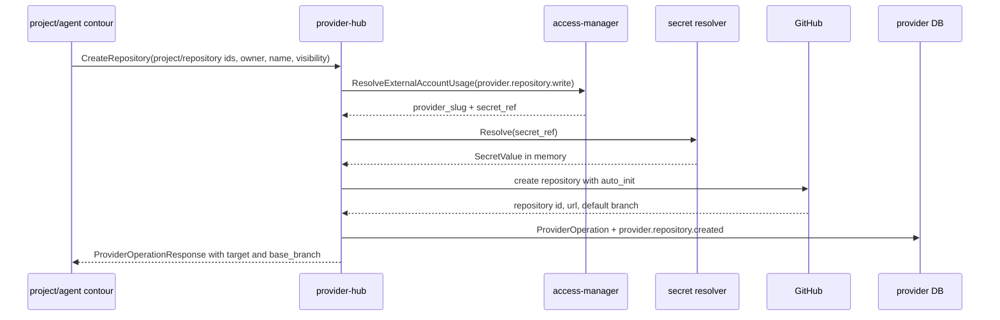
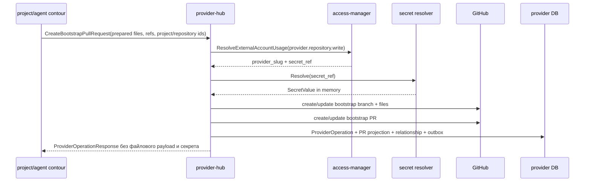
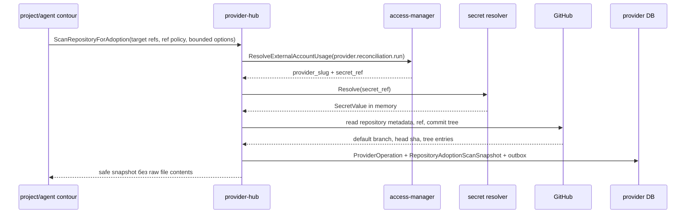
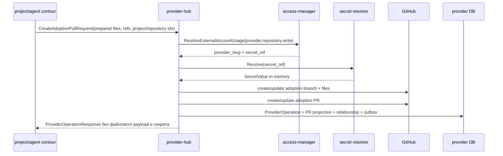
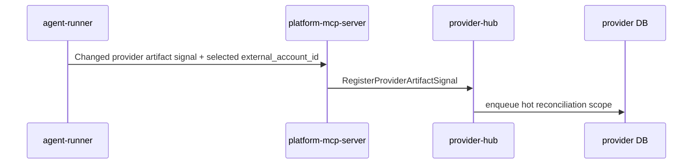

# Детальный дизайн: домен рабочих сущностей провайдера

## TL;DR

- Что меняем: вводим `provider-hub` как сервис-владелец provider-native зеркала, webhook inbox, сверки, лимитов и операций провайдера.
- Почему: платформа должна быстро показывать `Issue`, `PR/MR`, комментарии и связи, не превращаясь в замену GitHub/GitLab и не упираясь в лимиты.
- Основные компоненты: БД `provider-hub`, gRPC API, provider adapters, webhook inbox, нормализатор, reconciliation, журнал операций, outbox событий.
- Риски: смешать зеркало провайдера с проектным каталогом, начать хранить полные внешние данные без retention или перенести HTTP webhook gateway внутрь домена.

## Цели

- Зафиксировать границу `provider-hub`.
- Подготовить provider-first реализацию для GitHub с заделом под GitLab.
- Дать UI, MCP, agent-manager и operations-hub локальные проекции рабочих артефактов.
- Обеспечить webhook + incremental reconciliation как штатный контур синхронизации.
- Отделить политику внешних аккаунтов от runtime-состояния их использования у провайдера.

## Не-цели

- Не реализовывать публичный HTTP webhook endpoint внутри `provider-hub`.
- Не хранить проектную политику, `services.yaml`, правила веток и релизные политики.
- Не вычислять доступы и не владеть внешними аккаунтами как субъектами политики.
- Не запускать flow, роли, слоты, задания, сборку или deploy.
- Не делать пользовательский интерфейс в этом домене.

## Граница сервиса

| Владеет `provider-hub` | Не владеет |
|---|---|
| Webhook inbox, нормализованные provider events, проекции провайдера, связи провайдера, sync cursors, drift status, runtime-состояние внешнего аккаунта у провайдера, лимиты, операции провайдера, provider adapters. | Проекты и репозитории как проектные сущности, `services.yaml`, policy внешних аккаунтов, flow, роли, run, slot, job, уведомления, пакетный каталог, публичный HTTP gateway. |

Провайдер остаётся источником истины по `Issue`, `PR/MR`, комментариям, review, веткам, тегам и нативным связям. `provider-hub` хранит только нормализованную и операционно полезную проекцию: поля для UI, поиска, приёмки, связей, watermark, digest, состояния синхронизации и аудита операций.

## Компоненты

| Компонент | Назначение |
|---|---|
| `provider-hub` | Сервис-владелец домена рабочих сущностей провайдера. |
| БД `provider-hub` | Проекции, входящий журнал webhook, курсоры сверки, лимиты и журнал операций. |
| Provider adapters | Изолируют GitHub/GitLab API, специфичную для провайдера форму payload и возвращают нормализованные модели. |
| Webhook inbox | Сохраняет входящие события, дедуплицирует и держит статус обработки. |
| Нормализатор webhook | Порт доменного сервиса, реализация которого живёт в слое адаптеров конкретного провайдера и возвращает нейтральные факты провайдера. |
| Reconciliation | Догоняет потерянные webhook через курсоры, окно перекрытия и приоритеты. |
| Исполнитель операций | Выполняет разрешённые provider-операции и пишет операционный след. |
| Outbox-доставщик | Публикует `provider.*` события после фиксации транзакции. |

## Основные потоки

### Обработка webhook

`integration-gateway` отвечает за внешний HTTP, проверку подписи, размер payload, redaction, лимиты и backpressure. `provider-hub` принимает только внутренний вызов и не содержит публичной HTTP-поверхности.

Первый рабочий контур выполняет быстрый проход нормализации прямо при приёме внутреннего вызова: webhook попадает во входящий журнал, получает финальный статус `processed`, `ignored` или `failed`, обновляет доступные проекции `Issue`, `PR/MR`, комментариев и связей, а локальный outbox получает события `provider.webhook.received`, `provider.webhook.normalized` и соответствующие события синхронизации проекций. Это не отменяет будущий асинхронный обработчик: повторная обработка уже поддерживает статусы `pending` и `failed`, а сверка закрывает пропущенные или устаревшие изменения.

### Сверка после потерянного webhook

Сверка не выполняет постоянный полный обход провайдера. Она использует курсор, окно перекрытия, лимитный бюджет и приоритеты горячих, тёплых и холодных сущностей. Внешний аккаунт фиксируется при постановке курсора в очередь: политика вызывающего сценария выбирает аккаунт, а worker только подтверждает его через `access-manager` перед обращением к API провайдера.

### Платформенная provider-операция

Снаружи операции записи остаются типизированными инструментами: создать репозиторий, создать задачу, обновить задачу, создать или обновить комментарий, создать `PR/MR`, оставить review-сигнал, обновить связь. Внутри `provider-hub` они сходятся в общий конвейер команд: проверка команды и идемпотентности, проверка `operation_policy_context`, подтверждение `external_account_id` через `access-manager`, проверка ссылки на approval/gate, выполнение команды адаптера и запись `ProviderOperation`.

`provider-hub` не решает сам, можно ли использовать внешний аккаунт, и не становится владельцем approval. В операциях и сверке внешний аккаунт передаётся явно по политике вызывающего сценария или по уже сохранённому курсору. Если политика по риску требует approval/gate, вызывающий контур передаёт `approval_gate_ref`; `provider-hub` только проверяет наличие ссылки и сохраняет её в журнале операции. Общий command pipeline фиксирует `ProviderOperation`, `operation_policy_context`, `approval_gate_ref`, optimistic concurrency по локальной версии и outbox-событие результата. Реальный GitHub write-вызов выполняется через provider-адаптер поверх этого конвейера: `provider-hub` запрашивает подтверждение у `access-manager`, получает только ссылку на секрет, затем получает `SecretValue` через общий `libs/go/secretresolver`, выполняет операцию через адаптер и фиксирует результат. Значение секрета живёт только в памяти процесса на время внешнего вызова и не попадает в БД `provider-hub`, журнал операций, outbox, тело аудита, трассировку, логи или ошибки. `access-manager` не возвращает значение токена и не становится прокси секретов.

В пакетной сверке только на чтение обработчик берёт арендованный `SyncCursor`, подтверждает `provider.reconciliation.run` через `access-manager`, получает токен через resolver только на время GitHub API-вызова и сохраняет только нормализованные проекции, операционное состояние, лимитный бюджет и безопасный код ошибки. Исчерпание лимита провайдера не считается бизнес-ошибкой: cursor остаётся с lease до retry-времени. Ошибка авторизации переводит runtime state аккаунта в `reauthorization_required`; отсутствие объекта, временные и постоянные ошибки фиксируются коротким кодом без provider payload и без секрета.

### Создание репозитория у провайдера

Provider-side создание репозитория — отдельная команда `CreateRepository`. `project-catalog`, `agent-manager` или детерминированный bootstrap-исполнитель заранее выбирают project/repository binding, владельца репозитория, имя, видимость и внешний аккаунт. `provider-hub` подтверждает внешний аккаунт через `access-manager`, получает секрет только на время provider API-вызова и выполняет только нативное создание репозитория.

Для GitHub команда создаёт репозиторий с `auto_init=true`: провайдер сам создаёт начальный default branch и минимальный начальный commit. Это нужно, потому что GitHub не позволяет создать ref в полностью пустом репозитории без commit. `provider-hub` возвращает `base_branch`, provider repository id и URL, фиксирует `ProviderOperation` и публикует `provider.repository.created`.

`provider-hub` не генерирует `services.yaml`, не выбирает шаблон, не запускает adoption scan, не меняет branch protection и не создаёт bootstrap PR в этой команде. Эти действия остаются за проектным, пакетным, агентным и bootstrap-контурами.

### Bootstrap пустого репозитория

Provider-side часть модели C для пустого репозитория работает с уже созданным репозиторием. Репозиторий может быть создан заранее человеком или командой `CreateRepository`. `project-catalog`, `package-hub`, `agent-manager` или детерминированный bootstrap-исполнитель заранее готовят payload: список текстовых файлов, base branch, bootstrap branch, заголовок и тело PR, watermark и ссылки `project_id`/`repository_id`. `provider-hub` принимает этот payload через `CreateBootstrapPullRequest`, подтверждает внешний аккаунт через `access-manager`, получает секрет только на время GitHub API-вызова и выполняет provider-native запись.

Bootstrap-команда не создаёт сам репозиторий у провайдера, не создаёт начальный base ref, не генерирует `services.yaml`, не выбирает шаблоны и не сканирует содержимое репозитория. Она отклоняется, если `base_branch` и `bootstrap_branch` совпадают, либо если дерево `base_branch` содержит что-либо кроме безопасного `README.md`, созданного провайдером при `auto_init`. Если bootstrap branch уже существует после неудачной или повторной попытки, новый commit строится от текущей головы bootstrap branch, но дерево commit собирается из пустого дерева или дерева только с `README.md` и подготовленного набора файлов, чтобы не протащить старые файлы. После успешной записи сервис обновляет локальную проекцию bootstrap `PR/MR`, проставляет `project_id` и `repository_id`, создаёт provider relationship `project_repository_binding` и публикует `provider.repository.bootstrap_completed`. Содержимое подготовленных файлов остаётся только входом provider-вызова и не сохраняется в журнале операций, outbox, событиях, логах, ошибках или трассировке.

После merge bootstrap `PR/MR` provider-side контур отвечает за факт provider-native изменения: webhook inbox, нормализацию, PR/MR projection и безопасные refs. Для GitHub закрытый и смёрженный `pull_request` создаёт `RepositoryMergeSignal` kind `bootstrap` с project/repository refs, PR number/id/url, base/head branch, merge commit sha, source ref, related provider operation ref, watermark digest, timestamps, status и version. Проверенная проекция `services.yaml` импортируется не в `provider-hub`, а в `project-catalog` через внутреннюю команду `ImportBootstrapServicesPolicy`. В этот вызов не передаются raw webhook body, полный provider response или содержимое provider payload; только безопасные ссылки, source ref, commit, `content_hash`, watermark и нормализованный checked payload, подготовленный вызывающим контуром.

### Lightweight scan существующего репозитория

Перед проектным решением по adoption вызывающий контур может запросить `ScanRepositoryForAdoption`. Это provider-side read-команда: `provider-hub` подтверждает выбранный внешний аккаунт через `access-manager`, получает секрет только на время GitHub API-вызова, читает metadata/ref/tree существующего репозитория и возвращает безопасный snapshot без чтения blob/file contents.

Snapshot содержит provider refs, default branch, requested/scanned ref, head sha, обнаруженные marker path refs (`services.yaml`, `.gitmodules`, `README`, `AGENTS.md`, `docs`, workflow/deploy/module/package markers), object digests, counts, bounded warnings, status и snapshot digest. `provider-hub` не читает содержимое файлов, не строит adoption report, не выбирает шаблон, не импортирует `services.yaml`, не запускает агента и не создаёт проектную политику. Повтор той же команды по `command_id` возвращает сохранённый snapshot и не выполняет второй provider API scan.

### Подключение существующего репозитория через adoption PR

Provider-side часть adoption PR работает с уже существующим репозиторием и не принимает проектные решения. `agent-manager`, детерминированный исполнитель или другой проектный контур использует lightweight snapshot, глубокий workspace scan или другой согласованный вход, готовит отчёт, выбирает шаблон или фиксирует отказ от шаблона, формирует набор текстовых файлов, refs, заголовок и тело reviewable `PR/MR`. `provider-hub` принимает этот готовый payload через `CreateAdoptionPullRequest`, подтверждает внешний аккаунт через `access-manager`, получает секрет только на время GitHub API-вызова и выполняет provider-native запись.

Adoption PR-команда не создаёт репозиторий, не выполняет scan, не генерирует `services.yaml`, не выбирает шаблон и не меняет branch protection. В отличие от bootstrap, она допускает непустой `base_branch`, потому что работает с существующим репозиторием. Если adoption branch уже существует, новая команда строит commit от текущей головы adoption branch, но дерево commit собирается из текущего дерева base branch и подготовленного набора файлов. После успешной записи сервис обновляет локальную проекцию adoption `PR/MR`, проставляет `project_id` и `repository_id`, создаёт provider relationship `project_repository_binding` и публикует `provider.repository.adoption_pr_created`. Содержимое подготовленных файлов не сохраняется в журнале операций, outbox, событиях, логах, ошибках или трассировке.

После merge adoption `PR/MR` provider-side контур фиксирует `RepositoryMergeSignal` kind `adoption` по тем же правилам, что bootstrap: только безопасные refs, digest, timestamps и статус. Повтор того же provider PR merge не создаёт второй сигнал или outbox event, а конфликтующий commit/source ref отклоняется как конфликт. Глубокий workspace scan, отчёт, проверка `services.yaml`, выбор шаблона и активация project binding остаются у соседних доменов.

### Сигнал от slot-агента

Сигнал от агента ускоряет обновление проекции, но не заменяет webhook и reconciliation. Вызывающий контур передаёт уже выбранный внешний аккаунт; `provider-hub` использует его только как часть курсора сверки и не получает значение секрета в этом сценарии.

## Междоменные связи

| Домен | Связь |
|---|---|
| `access-manager` | Владеет политикой внешних аккаунтов; `provider-hub` запрашивает разрешение и не хранит сырые секреты. |
| `project-catalog` | Владеет проектом и repository binding; `provider-hub` связывает provider-native артефакты с этими идентификаторами. |
| `agent-manager` | Запрашивает provider-операции и использует проекции для приёмки. |
| `package-hub` | Использует provider-репозитории как источники пакетов, но не владеет provider mirror. |
| `integration-gateway` | Принимает внешний webhook и передаёт проверенный сигнал в `provider-hub`. |
| `operations-hub` | Читает события и строит операторские проекции. |
| `worker` | Исполняет сверку по поручению `provider-hub`, не владея доменной истиной. |

## События

Минимальные события:

- `provider.webhook.received`;
- `provider.webhook.normalized`;
- `provider.work_item.synced`;
- `provider.work_item.drift_detected`;
- `provider.comment.synced`;
- `provider.relationship.synced`;
- `provider.sync_cursor.advanced`;
- `provider.account_runtime_state.changed`;
- `provider.limit_snapshot.recorded`;
- `provider.operation.completed`;
- `provider.operation.failed`;
- `provider.repository.created`;
- `provider.repository.bootstrap_required`;
- `provider.repository.adoption_required`;
- `provider.repository.bootstrap_completed`;
- `provider.repository.adoption_pr_created`;
- `provider.repository.adoption_scan_completed`;
- `provider.repository.bootstrap_merged`;
- `provider.repository.adoption_merged`.

## Правила хранения

- Сырые webhook payload хранятся с retention и не становятся вечной историей.
- Проекции хранят нормализованные поля, нужные для UI, поиска, приёмки, связей и сверки.
- Полный diff, review truth, ветки, теги и финальное внешнее состояние остаются у провайдера.
- Ссылки на проекты, репозитории, внешние аккаунты, run и job хранятся как внешние идентификаторы без SQL-связей с чужими БД.

## Наблюдаемость

- Метрики: входящие webhook, dedupe, ошибки нормализации, задержка обработки, длительность сверки, lightweight adoption scan, drift status, расход лимитов, ошибки provider API.
- Логи: операции, webhook delivery id, provider type, repository ref, aggregate id, correlation id, ошибка и классификация.
- Трейсы: входящий webhook, provider operation, reconciliation, чтение проекции.
- Алерты: рост ошибок webhook, длительная рассинхронизация, исчерпание лимита, потеря авторизации внешнего аккаунта.

## Риски

| Риск | Митигирующее решение |
|---|---|
| Сервис начнёт заменять GitHub/GitLab как источник истины. | В документах и API разделить projection и authoritative read. |
| Потерянный webhook оставит UI в вечной рассинхронизации. | Incremental reconciliation обязателен с первого рабочего контура. |
| Лимиты провайдера будут исчерпаны полным обходом. | Использовать cursor, overlap window, приоритеты и rate budget. |
| GitHub-specific модель заблокирует GitLab. | Все provider-specific поля держать за adapter boundary. |
| HTTP webhook попадёт в доменный сервис. | Публичный вход закрепить за `integration-gateway`. |

## Апрув

- request_id: `owner-2026-05-06-provider-hub-boundaries`
- Решение: approved
- Комментарий: дизайн домена рабочих сущностей провайдера согласован как целевое состояние.
