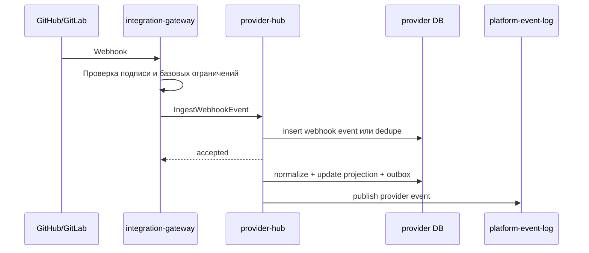
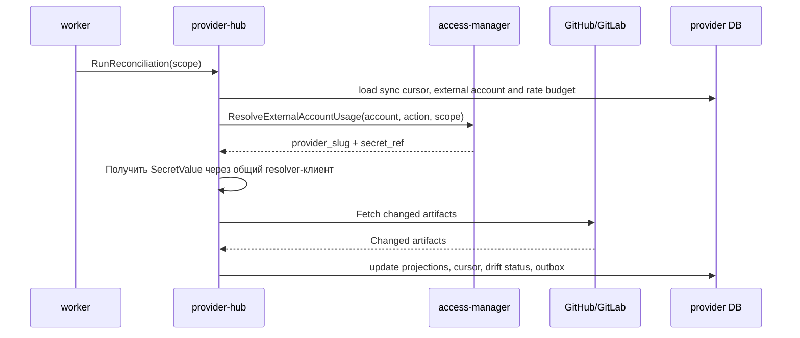
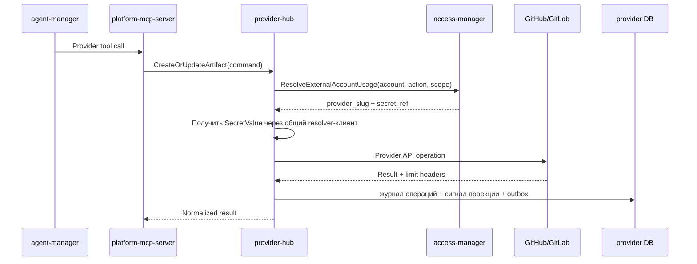
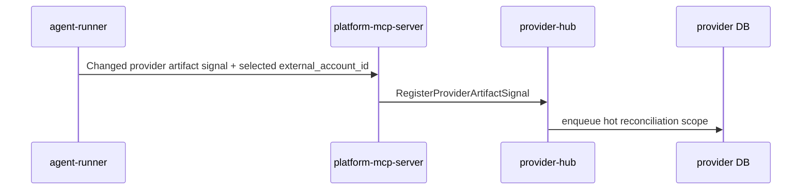

# Детальный дизайн: домен рабочих сущностей провайдера

## TL;DR

- Что меняем: вводим `provider-hub` как сервис-владелец provider-native зеркала, webhook inbox, сверки, лимитов и операций провайдера.
- Почему: платформа должна быстро показывать `Issue`, `PR/MR`, комментарии и связи, не превращаясь в замену GitHub/GitLab и не упираясь в лимиты.
- Основные компоненты: БД `provider-hub`, gRPC API, provider adapters, webhook inbox, нормализатор, reconciliation, журнал операций, outbox событий.
- Риски: смешать зеркало провайдера с проектным каталогом, начать хранить полные внешние данные без retention или перенести HTTP webhook gateway внутрь домена.

## Цели

- Зафиксировать границу `provider-hub`.
- Подготовить provider-first реализацию для GitHub с заделом под GitLab.
- Дать UI, MCP, agent-manager и operations-hub локальные проекции рабочих артефактов.
- Обеспечить webhook + incremental reconciliation как штатный контур синхронизации.
- Отделить политику внешних аккаунтов от runtime-состояния их использования у провайдера.

## Не-цели

- Не реализовывать публичный HTTP webhook endpoint внутри `provider-hub`.
- Не хранить проектную политику, `services.yaml`, правила веток и релизные политики.
- Не вычислять доступы и не владеть внешними аккаунтами как субъектами политики.
- Не запускать flow, роли, слоты, задания, сборку или deploy.
- Не делать пользовательский интерфейс в этом домене.

## Граница сервиса

| Владеет `provider-hub` | Не владеет |
|---|---|
| Webhook inbox, нормализованные provider events, проекции провайдера, связи провайдера, sync cursors, drift status, runtime-состояние внешнего аккаунта у провайдера, лимиты, операции провайдера, provider adapters. | Проекты и репозитории как проектные сущности, `services.yaml`, policy внешних аккаунтов, flow, роли, run, slot, job, уведомления, пакетный каталог, публичный HTTP gateway. |

Провайдер остаётся источником истины по `Issue`, `PR/MR`, комментариям, review, веткам, тегам и нативным связям. `provider-hub` хранит только нормализованную и операционно полезную проекцию: поля для UI, поиска, приёмки, связей, watermark, digest, состояния синхронизации и аудита операций.

## Компоненты

| Компонент | Назначение |
|---|---|
| `provider-hub` | Сервис-владелец домена рабочих сущностей провайдера. |
| БД `provider-hub` | Проекции, входящий журнал webhook, курсоры сверки, лимиты и журнал операций. |
| Provider adapters | Изолируют GitHub/GitLab API, специфичную для провайдера форму payload и возвращают нормализованные модели. |
| Webhook inbox | Сохраняет входящие события, дедуплицирует и держит статус обработки. |
| Нормализатор webhook | Порт доменного сервиса, реализация которого живёт в слое адаптеров конкретного провайдера и возвращает нейтральные факты провайдера. |
| Reconciliation | Догоняет потерянные webhook через курсоры, окно перекрытия и приоритеты. |
| Operation executor | Выполняет разрешённые provider-операции и пишет операционный след. |
| Outbox-доставщик | Публикует `provider.*` события после фиксации транзакции. |

## Основные потоки

### Обработка webhook

`integration-gateway` отвечает за внешний HTTP, проверку подписи и пограничные ограничения. `provider-hub` принимает только внутренний вызов и не содержит публичной HTTP-поверхности.

Первый рабочий контур выполняет быстрый проход нормализации прямо при приёме внутреннего вызова: webhook попадает во входящий журнал, получает финальный статус `processed`, `ignored` или `failed`, обновляет доступные проекции `Issue`, `PR/MR`, комментариев и связей, а локальный outbox получает события `provider.webhook.received`, `provider.webhook.normalized` и соответствующие события синхронизации проекций. Это не отменяет будущий асинхронный обработчик: повторная обработка уже поддерживает статусы `pending` и `failed`, а сверка закрывает пропущенные или устаревшие изменения.

### Сверка после потерянного webhook

Сверка не выполняет постоянный полный обход провайдера. Она использует курсор, окно перекрытия, лимитный бюджет и приоритеты горячих, тёплых и холодных сущностей. Внешний аккаунт фиксируется при постановке курсора в очередь: политика вызывающего сценария выбирает аккаунт, а worker только подтверждает его через `access-manager` перед обращением к API провайдера.

### Платформенная provider-операция

`provider-hub` не решает сам, можно ли использовать внешний аккаунт. В операциях и сверке внешний аккаунт передаётся явно по политике вызывающего сценария или по уже сохранённому курсору. `provider-hub` запрашивает подтверждение у `access-manager`, получает только ссылку на секрет, затем получает `SecretValue` через общий `libs/go/secretresolver`, выполняет операцию через адаптер и фиксирует результат. Значение секрета живёт только в памяти процесса на время внешнего вызова и не попадает в БД `provider-hub`, журнал операций, outbox, тело аудита, трассировку, логи или ошибки. `access-manager` не возвращает значение токена и не становится прокси секретов.

В пакетной сверке только на чтение обработчик берёт арендованный `SyncCursor`, подтверждает `provider.reconciliation.run` через `access-manager`, получает токен через resolver только на время GitHub API-вызова и сохраняет только нормализованные проекции, операционное состояние, лимитный бюджет и безопасный код ошибки. Исчерпание лимита провайдера не считается бизнес-ошибкой: cursor остаётся с lease до retry-времени. Ошибка авторизации переводит runtime state аккаунта в `reauthorization_required`; отсутствие объекта, временные и постоянные ошибки фиксируются коротким кодом без provider payload и без секрета.

### Сигнал от slot-агента

Сигнал от агента ускоряет обновление проекции, но не заменяет webhook и reconciliation. Вызывающий контур передаёт уже выбранный внешний аккаунт; `provider-hub` использует его только как часть курсора сверки и не получает значение секрета в этом сценарии.

## Междоменные связи

| Домен | Связь |
|---|---|
| `access-manager` | Владеет политикой внешних аккаунтов; `provider-hub` запрашивает разрешение и не хранит сырые секреты. |
| `project-catalog` | Владеет проектом и repository binding; `provider-hub` связывает provider-native артефакты с этими идентификаторами. |
| `agent-manager` | Запрашивает provider-операции и использует проекции для приёмки. |
| `package-hub` | Использует provider-репозитории как источники пакетов, но не владеет provider mirror. |
| `integration-gateway` | Принимает внешний webhook и передаёт проверенный сигнал в `provider-hub`. |
| `operations-hub` | Читает события и строит операторские проекции. |
| `worker` | Исполняет сверку по поручению `provider-hub`, не владея доменной истиной. |

## События

Минимальные события:

- `provider.webhook.received`;
- `provider.webhook.normalized`;
- `provider.work_item.synced`;
- `provider.work_item.drift_detected`;
- `provider.comment.synced`;
- `provider.relationship.synced`;
- `provider.sync_cursor.advanced`;
- `provider.account_runtime_state.changed`;
- `provider.limit_snapshot.recorded`;
- `provider.operation.completed`;
- `provider.operation.failed`;
- `provider.repository.bootstrap_required`;
- `provider.repository.adoption_required`;
- `provider.repository.bootstrap_completed`;
- `provider.repository.adoption_pr_created`.

## Правила хранения

- Сырые webhook payload хранятся с retention и не становятся вечной историей.
- Проекции хранят нормализованные поля, нужные для UI, поиска, приёмки, связей и сверки.
- Полный diff, review truth, ветки, теги и финальное внешнее состояние остаются у провайдера.
- Ссылки на проекты, репозитории, внешние аккаунты, run и job хранятся как внешние идентификаторы без SQL-связей с чужими БД.

## Наблюдаемость

- Метрики: входящие webhook, dedupe, ошибки нормализации, задержка обработки, длительность сверки, drift status, расход лимитов, ошибки provider API.
- Логи: операции, webhook delivery id, provider type, repository ref, aggregate id, correlation id, ошибка и классификация.
- Трейсы: входящий webhook, provider operation, reconciliation, чтение проекции.
- Алерты: рост ошибок webhook, длительная рассинхронизация, исчерпание лимита, потеря авторизации внешнего аккаунта.

## Риски

| Риск | Митигирующее решение |
|---|---|
| Сервис начнёт заменять GitHub/GitLab как источник истины. | В документах и API разделить projection и authoritative read. |
| Потерянный webhook оставит UI в вечной рассинхронизации. | Incremental reconciliation обязателен с первого рабочего контура. |
| Лимиты провайдера будут исчерпаны полным обходом. | Использовать cursor, overlap window, приоритеты и rate budget. |
| GitHub-specific модель заблокирует GitLab. | Все provider-specific поля держать за adapter boundary. |
| HTTP webhook попадёт в доменный сервис. | Публичный вход закрепить за `integration-gateway`. |

## Апрув

- request_id: `owner-2026-05-06-provider-hub-boundaries`
- Решение: approved
- Комментарий: дизайн домена рабочих сущностей провайдера согласован как целевое состояние PRV-0.
