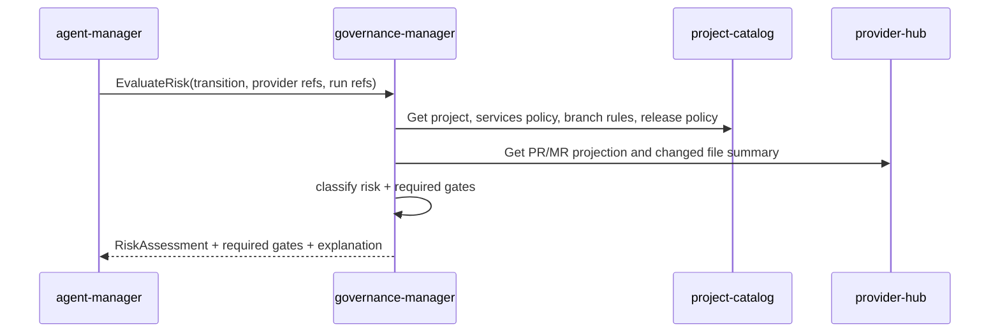
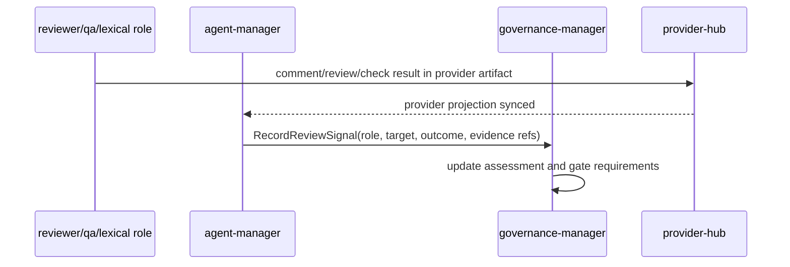
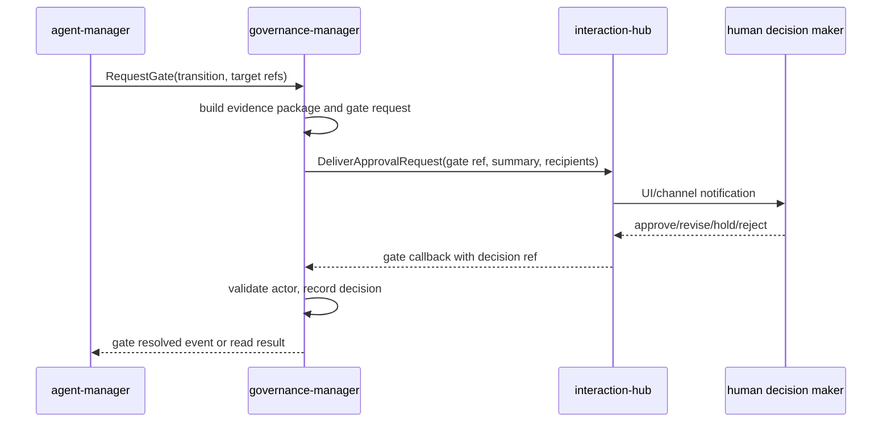
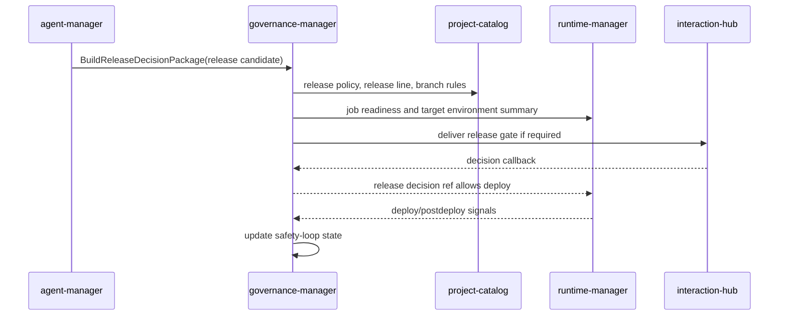

# Детальный дизайн: риски и релизы

## TL;DR

- Что меняем: вводим `governance-manager` как сервис-владелец risk/release governance.
- Почему: risk gates, role-driven review gates, approvals и release decisions не должны жить вторичной логикой внутри `project-catalog`, `agent-manager` или `interaction-hub`.
- Основные компоненты: БД `governance-manager`, policy evaluator, risk classifier, review signal intake, gate decision engine, release decision package, safety-loop tracker и outbox событий.
- Риски: продублировать проектную policy, превратить delivery уведомлений в governance-решение или начать блокировать безопасную автоматизацию низкого риска.

## Цели

- Зафиксировать отдельную сервисную границу `governance-manager`.
- Описать, где хранится риск-политика и как она связывается с проектной политикой.
- Описать классификацию риска по diff, сервису, API, БД, секретам, runtime action и release context.
- Описать role-driven review gates и policy-based approvals без подмены Human gate агентным комментарием.
- Отделить decision state от доставки через `interaction-hub`.
- Поддерживать контрактный срез без сервисной бизнес-реализации, storage, evaluator, UI или gateway.

## Не-цели

- Не реализовывать сервисный процесс, handlers, БД, миграции, evaluator, UI или gateway.
- Не менять `project-catalog`, `agent-manager`, `provider-hub`, `runtime-manager` или `interaction-hub` кодом.
- Не переносить проектную policy, branch rules или release policy из `project-catalog`.
- Не делать gateway или web-console экраны.
- Не хранить полный diff, сырые provider payload, значения секретов или полные runtime logs.

## Граница сервиса

| Владеет `governance-manager` | Не владеет |
|---|---|
| Risk profiles, risk rules, gate policy, risk assessments, risk factor history, review signals, gate requests, gate decisions, release decision packages, release decisions, release safety-loop state, governance outbox. | Проекты, репозитории, `services.yaml`, branch rules, release policy и release line; flow/stage/run/acceptance; provider-native `Issue/PR/MR`; runtime slots/jobs; delivery notifications/callback transport; UI/gateway. |

`project-catalog` остаётся владельцем проектной политики. Он может хранить ссылки на risk profile в release policy или `services.yaml` projection, но содержимое risk profile и gate policy владеется `governance-manager`.

`agent-manager` остаётся владельцем flow, роли, acceptance и ожиданий перехода. Он запрашивает risk assessment или gate decision у `governance-manager`, а не сам становится владельцем risk decision.

`interaction-hub` доставляет человеку запрос решения, reminder, escalation и внешний callback. Он не решает, достаточно ли evidence, какой risk class активен и можно ли продолжать переход.

## Компоненты

| Компонент | Назначение |
|---|---|
| `governance-manager` | Сервис-владелец домена risk/release governance. |
| БД `governance-manager` | Risk policy, assessments, signals, gate/release decisions, safety-loop state, command results и outbox. |
| Policy evaluator | Читает governance policy, project/release refs и возвращает required checks/gates. |
| Risk classifier | Рассчитывает initial и effective risk class по факторам diff, target, policy и signals. |
| Review signal intake | Принимает signals от agent roles, людей, provider review и runtime/postdeploy checks. |
| Gate decision engine | Создаёт gate requests, собирает evidence package и фиксирует outcome. |
| Release decision package builder | Собирает release context: linked issues/PRs, release line, rollout strategy, checks, signals и known limitations. |
| Safety-loop tracker | Ведёт состояния `release_candidate`, `awaiting_release_gate`, `deploying`, `postdeploy_observation`, `stable`, `hold`, `rollback`, `follow_up_required`. |
| Outbox-доставщик | Публикует `governance.*` события через `platform-event-log`. |

## Основные потоки

### Оценка риска перехода

Оценка не требует полного построчного чтения кода. Для initial classification достаточно проверенной project policy, changed files summary, service mapping, API/DB/secret markers, release context и уже известных signals. Более сильная роль может позже повысить риск.

### Review signals от ролей

Роль создаёт проверяемый signal. Signal может блокировать переход, рекомендовать повышение риска, подтверждать конкретный тип evidence или требовать revise. Он не заменяет Human gate, если policy требует человеческое решение.

### Human gate без владения доставкой

`governance-manager` владеет gate request и decision record. `interaction-hub` владеет доставкой, retry, channel callback и escalation transport.

### Release decision и postdeploy

Успешный deploy `job` не закрывает релиз. Governance ждёт postdeploy signals и фиксирует итог: `stable`, `hold`, `rollback` или `follow_up_required`.

## Классификация риска

Минимальные источники факторов:
- тип provider artifact: `Issue`, `PR/MR`, release candidate, runtime `job`;
- changed files и path/glob rules;
- service mapping из проверенного `services.yaml`;
- тип сервиса: auth, backend, frontend, worker, package, infra;
- API endpoint или protocol contract;
- DB migration, schema, data backfill, production data access;
- secret-bearing area: tokens, credentials, OAuth/OIDC, webhook secrets, signing keys;
- branch/release policy usage: protected branch, release branch, release line, rollout strategy;
- target environment: local, slot, `full-env`, staging, production read-only, production write;
- automation source: manual, cron, alert, external callback;
- signals от reviewer/QA/SRE/security/lexical/risk roles.

Базовая шкала сохраняет классы `R0`, `R1`, `R2`, `R3`. Итоговый effective risk class равен максимальному классу среди policy, diff factors, target action и blocking signals.

## Обязательные Human gate

Human gate обязателен минимум для:
- изменения auth, SSO/OIDC, allowlist, external account и access policy;
- изменения секретов, secret refs, webhook signatures, token scopes и signing paths;
- production DB migration, destructive migration, backfill и data deletion;
- production write-path, destructive cleanup, rollback/recovery и cluster-impact action;
- deploy/release decision для `R2+` и любого `R3`;
- изменения risk profile, gate policy, release policy и branch rules с повышенным blast radius;
- изменения `services.yaml`, если затронуты сервисы, runtime policy, deploy, docs sources write mode, package/guidance refs или специальные risky paths;
- документов, которые фиксируют product direction, architecture boundary или release/risk policy.

Policy может усиливать список. Ослабление возможно только явным governance decision с человеком и reason.

## Safe automation

Низкорисковая автоматизация разрешается, если одновременно верно:
- effective risk class `R0` или допустимый по policy `R1`;
- required machine checks и acceptance passed;
- нет blocking review signals;
- target action не является production write, destructive или release gate;
- используемый automation trigger разрешён для данного scope;
- evidence package достаточно для аудита без человеческого решения.

Это правило защищает платформу от превращения governance в ручной bottleneck.

## События

Минимальные события:
- `governance.risk_assessment.requested`;
- `governance.risk_assessment.completed`;
- `governance.risk_assessment.changed`;
- `governance.review_signal.recorded`;
- `governance.gate.requested`;
- `governance.gate.resolved`;
- `governance.release_decision.requested`;
- `governance.release_decision.resolved`;
- `governance.release_decision_package.built`;
- `governance.release_safety_state.changed`;
- `governance.blocking_signal.recorded`;
- `governance.policy.version_activated`.

События не содержат секреты, полный diff или полные логи. Они передают refs, summary, risk class, status, outcome и безопасные evidence refs.

## Наблюдаемость

- Логи: command id, actor ref, target ref, risk assessment id, gate id, decision outcome, correlation id.
- Метрики: количество assessments по risk class, ожидающие gates, просроченные gates, blocking signals, release decisions, rollback/hold/follow-up outcomes.
- Трейсы: входящая команда, чтение project/provider/runtime refs, запись decision, outbox publication.
- Алерты: рост просроченных gates, повторяющиеся failed release decisions, систематическое отсутствие required signals, конфликт callback actor/policy.

## Риски

| Риск | Митигирующее решение |
|---|---|
| Governance начнёт дублировать project policy. | Хранить только risk/gate policy и refs; project/release truth читать из `project-catalog`. |
| `interaction-hub` станет владельцем approval state. | В `interaction-hub` передавать delivery request с gate ref; decision хранить в `governance-manager`. |
| Agent review заменит Human gate. | Review signal включать в evidence package; Human gate остаётся обязательным по policy. |
| Low-risk automation будет заблокирована формальностями. | Policy явно разрешает `R0` и безопасный `R1` без человека при наличии checks и отсутствии blockers. |
| Release завершится после deploy без postdeploy. | Safety-loop state хранится в governance и требует postdeploy outcome. |

## Апрув

- request_id: `owner-2026-05-22-risk-governance-kickoff`
- Решение: pending
- Комментарий: дизайн фиксирует выбранный owner-ом вариант отдельного `governance-manager`; контрактный срез не меняет сервисную границу.
