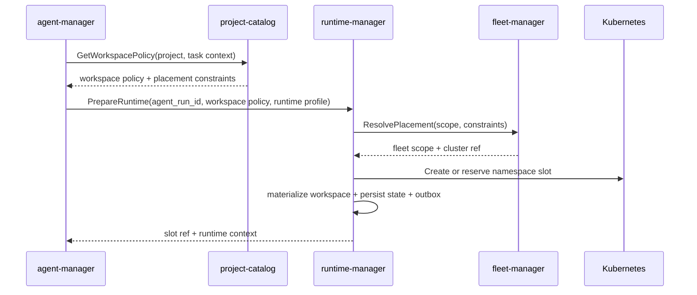
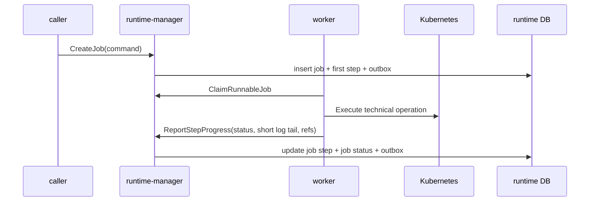
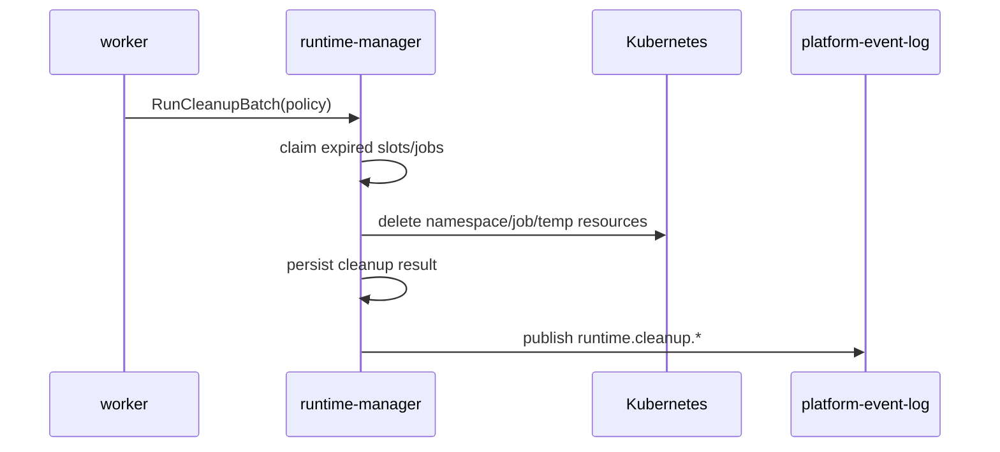

# Детальный дизайн: runtime и fleet

## TL;DR

- Что меняем: вводим `runtime-manager` как сервис-владелец слотов, workspace materialization, platform jobs, cleanup, prewarm, reuse и технического статуса среды.
- Почему: runtime-истина не должна жить в `agent-manager`, `project-catalog`, `worker`, shell-скриптах или UI.
- Основные компоненты: БД `runtime-manager`, gRPC API, outbox, слот, job, job step, workspace materialization, runtime artifact ref, cleanup policy и исполнительный контур через `worker`/Kubernetes.
- Риски: смешать `Run` и `Job`, сделать один кластер вечной моделью, начать хранить полные логи или сделать `runtime-manager` владельцем fleet.

## Цели

- Зафиксировать границу `runtime-manager` перед контрактами и кодом.
- Развести runtime, fleet и agent orchestration.
- Подготовить компактные срезы реализации без старого кода из `deprecated/**`.
- Описать MVP одного Kubernetes-кластера без архитектурной блокировки multi-cluster.
- Дать будущим `operations-hub`, `billing-hub` и release governance объяснимые runtime-сигналы.

## Не-цели

- Не проектировать полный `fleet-manager` в этом документе глубже, чем нужно для границы с runtime.
- Не реализовывать внешний HTTP gateway.
- Не описывать UI экранов.
- Не выбирать окончательный стек логирования, метрик и трассировки.
- Не переносить старые runtime-скрипты как целевую модель.

## Граница сервисов

| Владеет `runtime-manager` | Не владеет |
|---|---|
| Slot lifecycle, platform jobs, job steps, workspace materialization, runtime artifact refs, short log tail, cleanup policy, prewarm/reuse state, runtime status, runtime events. | Agent `Run`, flow, роли, сессии, provider-native артефакты, проекты, репозитории, `services.yaml`, release policy как истина, серверы, Kubernetes-кластеры, уведомления, биллинг. |

| Владеет `fleet-manager` | Не владеет |
|---|---|
| Серверы, Kubernetes-кластеры, connectivity, health, placement scope, привязки организаций, проектов и runtime-контуров к инфраструктуре. | Slot lifecycle, job status, workspace, build/deploy результат, agent run. |

Главное правило: `runtime-manager` исполняет на выбранном fleet scope. Он может хранить `fleet_scope_id`, `cluster_id`, `namespace`, `kube_context_ref` или их стабильные ссылки, но не становится владельцем реестра серверов и кластеров.

## Компоненты

| Компонент | Назначение |
|---|---|
| `runtime-manager` | Сервис-владелец runtime-домена. |
| БД `runtime-manager` | Слоты, задания, шаги, materialization attempts, runtime refs, cleanup policy и outbox. |
| Kubernetes adapter | Создаёт namespace, Job, Pod, ConfigMap, Secret reference и читает краткий runtime status. |
| Workspace materializer | Готовит локальные источники по workspace policy без владения этой policy. |
| Job controller | Ведёт state machine технических заданий и шагов. |
| Cleanup controller | Исполняет retention/cleanup и фиксирует сбои как runtime-состояние. |
| Prewarm controller | Поддерживает пул прогретых слотов по policy. |
| Outbox-доставщик | Публикует `runtime.*` события через `platform-event-log`. |

## Основные потоки

### Запрос runtime для агентной работы

`agent-manager` остаётся владельцем `Run`. `runtime-manager` не выбирает flow, роль, prompt или следующий этап.

### Выполнение platform job

`worker` может выполнять техническую работу, но не владеет конечным состоянием job.

### Cleanup и retention

Сбой cleanup не скрывается в логах. Он остаётся runtime-сигналом для `operations-hub` и будущих уведомлений.

## MVP одного кластера

В первом контуре допускается один Kubernetes-кластер, но он должен быть выражен явно:

- через config или seed-запись `default_fleet_scope`;
- через поля `fleet_scope_id` и `cluster_id` в командах и состоянии;
- через отдельный статус, что placement был разрешён упрощённым MVP-путём.

Запрещено:

- считать namespace name единственным идентификатором слота;
- хранить только kubeconfig path без fleet-ссылки;
- проектировать API так, будто второй кластер невозможен.

## Workspace materialization

`project-catalog` отдаёт состав workspace. `runtime-manager` выполняет подготовку и фиксирует факт:

- code repositories;
- project docs;
- service docs;
- dependent service docs;
- guidance package refs;
- generated execution context;
- writable/read-only mode;
- local path внутри slot;
- source commit/ref/digest;
- materialization fingerprint;
- ошибки доступа или checkout.

Flow, роли и шаблоны промптов не становятся файлами-источниками истины в workspace. В runtime попадает только отрендеренный execution context.

## Reuse и prewarm

Reuse разрешён только при совпадении:

- runtime profile;
- fleet scope;
- base image/toolchain;
- workspace source refs;
- materialization fingerprint;
- execution policy digest;
- безопасного статуса namespace;
- отсутствия активного конфликтующего job.

Prewarm slot не привязан к конкретной задаче. Он становится рабочим только после materialization.

## Междоменные связи

| Домен | Связь |
|---|---|
| `access-manager` | Проверка прав вызывающего сервиса и реакция на блокировку организации или пользователя. |
| `project-catalog` | Workspace policy, release policy, placement policy и проектные источники. |
| `provider-hub` | Provider refs для `Issue/PR/MR`, ускоряющие сигналы и ссылки на артефакты. |
| `package-hub` | Runtime requirements плагинов и refs руководящих пакетов. |
| `agent-manager` | Владеет `Run` и сессией, запрашивает runtime и получает slot/job refs. |
| `fleet-manager` | Выбирает и проверяет серверный или кластерный контур. |
| `worker` | Исполняет технические операции по поручению runtime. |
| `operations-hub` | Строит операторские проекции runtime status. |
| `billing-hub` | Получает будущие cost records по runtime usage. |

## События

Минимальные события:

- `runtime.slot.reserved`;
- `runtime.slot.lease_extended`;
- `runtime.slot.released`;
- `runtime.slot.failed`;
- `runtime.slot.cleanup_requested`;
- `runtime.slot.cleaned`;
- `runtime.workspace.materialization_started`;
- `runtime.workspace.materialization_completed`;
- `runtime.workspace.materialization_failed`;
- `runtime.job.created`;
- `runtime.job.started`;
- `runtime.job.step_updated`;
- `runtime.job.completed`;
- `runtime.job.failed`;
- `runtime.job.cancelled`;
- `runtime.cleanup.failed`;
- `runtime.prewarm.capacity_changed`.

Fleet-события должны иметь отдельный префикс `fleet.*`, когда будет реализован `fleet-manager`.

## Конкурентные изменения

- Изменяемые агрегаты имеют версию.
- Команды передают `command_id` и ожидаемую версию там, где изменяют ранее прочитанное состояние.
- Долгие операции не держат SQL-блокировки.
- Claim job/cleanup/slot work выполняется короткой арендой.
- Поздний исполнитель не может перезаписать результат новой попытки.

## Наблюдаемость

- Логи: команда, slot, job, step, workspace attempt, actor, correlation id, fleet scope, результат.
- Метрики: активные слоты, прогретые слоты, pending/running/failed jobs, длительность materialization, cleanup failures, cold start rate.
- Трейсы: входящий gRPC, проверка доступа, materialization, Kubernetes API, outbox publish.
- Алерты: рост failed jobs, застрявшие leases, cleanup failures, нехватка prewarmed slots, недоступность default cluster.

## Риски

| Риск | Митигирующее решение |
|---|---|
| `runtime-manager` начнёт владеть agent `Run`. | В API и БД хранить только external `agent_run_id`; run state остаётся в `agent-manager`. |
| Один стартовый кластер станет вечным архитектурным пределом. | Сразу хранить fleet refs и описать MVP default cluster как упрощение. |
| Полные логи заполнят PostgreSQL. | Хранить только short log tail и ссылку на полный источник. |
| Runtime начнёт выбирать placement вместо fleet. | `runtime-manager` вызывает `fleet-manager` или использует явный default fleet ref до готовности сервиса. |
| Cleanup останется невидимым. | Сделать cleanup job и failures доменными событиями runtime. |

## Апрув

- request_id: `owner-2026-05-07-runtime-manager-kickoff`
- Решение: approved
- Комментарий: дизайн домена runtime и fleet согласован как целевое состояние.
