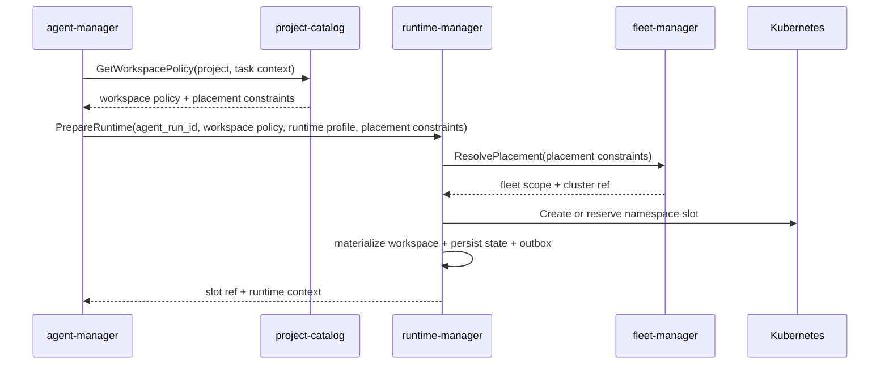
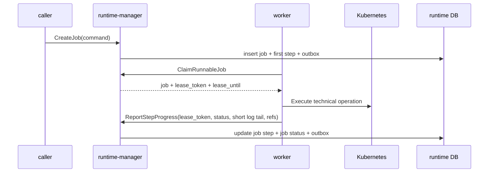
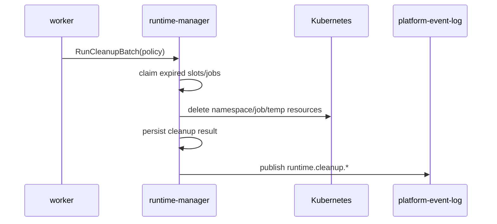

# Детальный дизайн: runtime и fleet

## TL;DR

- Что меняем: вводим `runtime-manager` как сервис-владелец слотов, workspace materialization, platform jobs, cleanup, prewarm, reuse и технического статуса среды.
- Почему: runtime-истина не должна жить в `agent-manager`, `project-catalog`, `worker`, shell-скриптах или UI.
- Основные компоненты: БД `runtime-manager`, gRPC API, outbox, слот, job, job step, workspace materialization, runtime artifact ref, cleanup policy и исполнительный контур через `worker`/Kubernetes.
- Риски: смешать `Run` и `Job`, сделать один кластер вечной моделью, начать хранить полные логи или сделать `runtime-manager` владельцем fleet.

## Цели

- Зафиксировать границу `runtime-manager` перед контрактами и кодом.
- Развести runtime, fleet и agent orchestration.
- Подготовить компактные срезы реализации без старого кода из `deprecated/**`.
- Описать MVP одного Kubernetes-кластера без архитектурной блокировки multi-cluster.
- Дать будущим `operations-hub`, `billing-hub` и release governance объяснимые runtime-сигналы.

## Не-цели

- Не проектировать полный `fleet-manager` в этом документе глубже, чем нужно для границы с runtime.
- Не реализовывать внешний HTTP gateway.
- Не описывать UI экранов.
- Не выбирать окончательный стек логирования, метрик и трассировки.
- Не переносить старые runtime-скрипты как целевую модель.

## Граница сервисов

| Владеет `runtime-manager` | Не владеет |
|---|---|
| Slot lifecycle, platform jobs, job steps, workspace materialization, runtime artifact refs, short log tail, cleanup policy, prewarm/reuse state, runtime status, runtime events. | Agent `Run`, flow, роли, сессии, provider-native артефакты, проекты, репозитории, `services.yaml`, release policy как истина, серверы, Kubernetes-кластеры, уведомления, биллинг. |

| Владеет `fleet-manager` | Не владеет |
|---|---|
| Серверы, Kubernetes-кластеры, connectivity, health, placement scope, привязки организаций, проектов и runtime-контуров к инфраструктуре. | Slot lifecycle, job status, workspace, build/deploy результат, agent run. |

Главное правило: `runtime-manager` исполняет на выбранном fleet scope. Он может хранить `fleet_scope_id`, `cluster_id`, `namespace`, `kube_context_ref` или их стабильные ссылки, но не становится владельцем реестра серверов и кластеров.

## Компоненты

| Компонент | Назначение |
|---|---|
| `runtime-manager` | Сервис-владелец runtime-домена. |
| БД `runtime-manager` | Слоты, задания, шаги, materialization attempts, runtime refs, cleanup policy и outbox. |
| Kubernetes adapter | Создаёт ограниченные Kubernetes Job для runtime-заданий, читает статус и короткий хвост лога через `client-go`, работает только по ссылкам на секреты из `fleet-manager` и не хранит kubeconfig. |
| Workspace materializer | Готовит локальные источники по workspace policy без владения этой policy. |
| Job controller | Ведёт state machine технических заданий и шагов. |
| Cleanup controller | Исполняет retention/cleanup и фиксирует сбои как runtime-состояние. |
| Prewarm controller | Поддерживает пул прогретых слотов по policy. |
| Outbox-доставщик | Публикует `runtime.*` события через `platform-event-log`. |

## Основные потоки

### Запрос runtime для агентной работы

`agent-manager` остаётся владельцем `Run`. `runtime-manager` не выбирает flow, роль, prompt или следующий этап.

Руководящие пакеты приходят в `workspace policy` как `WorkspaceSource.kind=guidance_package`. Механизм materialization получает безопасные refs запуска: package installation, package version, manifest digest, package slug, `safe_local_name` и capability refs. Перед checkout он по `package_version_ref` читает в `package-hub` тип source ref, значение source ref, commit SHA и идентичность источника, готовит checkout/mount только для чтения в `.kodex/guidance/<safe_local_name>` и сгенерированный контекст `.kodex/context/agent-run.json`. Runtime не меняет пакетную истину и не записывает manifest payload обратно в `agent-manager`.

### Выполнение platform job

`worker` может выполнять техническую работу, но не владеет конечным состоянием job.
Если lease истёк и задание забрал другой исполнитель, старый `lease_token` больше не принимается.
Повторный `ClaimRunnableJob` с тем же `command_id` или `idempotency_key` не забирает следующую job: runtime-manager находит сохранённый `RuntimeManagerCommandResult` и возвращает conflict, так как одноразовый `lease_token` не хранится в открытом виде и не переотдаётся при replay.

Тип `agent_run` выделен отдельно для agent Run: `agent-manager` может ставить такое задание через `CreateJob`, а Kubernetes-исполнитель `runtime-manager` забирает его через `ClaimRunnableJob` без обходной подмены на `build`, `deploy` или `housekeeping`. Runtime-manager хранит тип, ссылки, статус и диагностику, но не становится владельцем agent Run.

Перед реальным исполнением `agent_run` должен иметь typed `AgentRunExecutionSpec`; для agent Run его собирает `agent-manager` после `PrepareRuntime`, но передаёт в `CreateJob` только когда slot уже `ready`, а workspace materialization `completed`. В spec попадают только безопасные refs и контрольные значения: `agent_run_id`, `slot_id`, ожидаемая workspace materialization, workspace mount/PVC/workspace refs, `.kodex/context/agent-run.json` ref/digest, `runner_profile_ref`, `runner_image_ref`, фиксированный `runner_mode`, ссылки на разрешённые секреты без значений и цели отчёта runner. Optional `CodexSessionExecutionSpec` описывает будущий запуск Codex CLI: checked instruction object ref/digest, result schema ref/digest, session или workspace snapshot ref, hook endpoint/callback refs, timeout, fixed runner profile, output/result refs и allowed secret refs без значений. `CreateJob` сверяет spec с slot и завершённой materialization; задание без spec остаётся в ожидающем состоянии с безопасной диагностикой и не забирается исполнителем.

Первый реальный исполнитель Kubernetes находится внутри `runtime-manager` и выключен по умолчанию. После включения он забирает `health_check` job и `agent_run` job с валидным `AgentRunExecutionSpec`, получает `cluster_id` из сохранённого placement, читает через `fleet-manager.GetKubernetesCluster` только безопасную ссылку на kubeconfig/service account secret и создаёт ограниченный Kubernetes Job через `client-go`. Runtime не вызывает `kubectl`, не читает БД `fleet-manager`, не хранит kubeconfig и не пишет полный лог или Kubernetes events в PostgreSQL.

Для `health_check` поля `namespace`, `service_account`, `image` и `labels` проходят строгую проверку; значения `env`, annotations, команды контейнера, значения секретов, prompt, transcript и provider payload не принимаются. Команда контейнера фиксирована для проверки здоровья. Для `agent_run` произвольные поля не принимаются: executor читает только `agent_run_execution_spec`, требует workspace PVC ref, создаёт контейнер `runtime-agent-runner` с image из `runner_image_ref`, фиксированной командой `/kodex/bin/agent-runner run`, выключенным automount service account token, PVC mount в фиксированную точку `/workspace` и env только со safe refs/digest/fingerprint. Если присутствует `CodexSessionExecutionSpec`, executor передаёт его runner-у как bounded JSON env с безопасными refs; сам checked instruction input остаётся отдельным materialized workspace/object ref и не передаётся как текст. Secret refs остаются ссылками и не разрешаются в значения внутри `runtime-manager`.

Kubernetes worker не считает остановку сервиса ошибкой platform job. Если процесс завершается во время ожидания Kubernetes Job, worker прекращает текущую попытку без `FailJob`; после истечения lease задание может быть забрано повторно, а детерминированное имя Kubernetes Job позволяет продолжить сверку уже созданного объекта без дубля. Терминальными ошибками считаются таймаут, условие `JobFailed`, удалённый/отменённый Kubernetes Job и невозможность получить статус Kubernetes Job. Повторные ошибки claim/report/complete выполняются с увеличивающейся задержкой. Короткий хвост лога остаётся ограниченным по размеру и проходит через штатную границу `ReportJobStepProgress`/`CompleteJob`/`FailJob`.

### Cleanup и retention

Сбой cleanup не скрывается в логах. Он остаётся runtime-сигналом для `operations-hub` и будущих уведомлений.

## Размещение через `fleet-manager`

`runtime-manager` не выбирает Kubernetes-кластер самостоятельно. Для `PrepareRuntime`, `ReserveSlot` и `CreateJob` без уже выбранного slot он вызывает `fleet-manager.ResolvePlacement`, передавая безопасные ограничения размещения, runtime profile, runtime mode и ссылки на проект/репозитории/сервис. В ответ runtime сохраняет только итоговые `fleet_scope_id` и `cluster_id`.

`fleet-manager` остаётся владельцем правил размещения, учёта health, fallback на `platform-default` и журнала placement decisions. `runtime-manager` не хранит payload решения, не повторяет health/rules логику и не делает локальный default fallback для новых слотов и jobs.

Для `CreateJob` со slot повторный выбор размещения не выполняется: job наследует `fleet_scope_id` и `cluster_id` из slot, чтобы исполнитель работал в уже подготовленном runtime-контуре.

Запрещено:

- считать namespace name единственным идентификатором слота;
- хранить только kubeconfig path без fleet-ссылки;
- проектировать API так, будто второй кластер невозможен.

## Workspace materialization

`project-catalog` отдаёт состав workspace. `runtime-manager` выполняет подготовку и фиксирует факт:

- code repositories;
- project docs;
- service docs;
- dependent service docs;
- guidance package refs;
- generated execution context;
- writable/read-only mode;
- local path внутри slot;
- source commit/ref/digest;
- тип и идентичность источника для руководящих пакетов;
- materialization fingerprint;
- ошибки доступа или checkout.

Flow, роли и шаблоны промптов не становятся файлами-источниками истины в workspace. В runtime попадает только отрендеренный execution context.

## Reuse и prewarm

Reuse разрешён только при совпадении:

- runtime profile;
- fleet scope;
- base image/toolchain;
- workspace source refs;
- materialization fingerprint;
- execution policy digest;
- безопасного статуса namespace;
- отсутствия активного конфликтующего job.

Prewarm slot не привязан к конкретной задаче. Он становится рабочим только после materialization.

## Междоменные связи

| Домен | Связь |
|---|---|
| `access-manager` | Проверка прав вызывающего сервиса и реакция на блокировку организации или пользователя. |
| `project-catalog` | Workspace policy, release policy, placement policy и проектные источники. |
| `provider-hub` | Provider refs для `Issue/PR/MR`, ускоряющие сигналы и ссылки на артефакты. |
| `package-hub` | Runtime requirements плагинов, refs руководящих пакетов и авторитетная проверка идентичности источника перед materialization. |
| `agent-manager` | Владеет `Run` и сессией, запрашивает runtime и получает slot/job refs. |
| `fleet-manager` | Выбирает и проверяет серверный или кластерный контур. |
| `worker` | Исполняет технические операции по поручению runtime. |
| `operations-hub` | Строит операторские проекции runtime status. |
| `billing-hub` | Получает будущие cost records по runtime usage. |

## События

Минимальные события:

- `runtime.slot.reserved`;
- `runtime.slot.lease_extended`;
- `runtime.slot.released`;
- `runtime.slot.failed`;
- `runtime.slot.cleanup_requested`;
- `runtime.slot.cleaned`;
- `runtime.workspace.materialization_started`;
- `runtime.workspace.materialization_completed`;
- `runtime.workspace.materialization_failed`;
- `runtime.job.created`;
- `runtime.job.started`;
- `runtime.job.step_updated`;
- `runtime.job.completed`;
- `runtime.job.failed`;
- `runtime.job.cancelled`;
- `runtime.cleanup.failed`;
- `runtime.prewarm.capacity_changed`.

Fleet-события должны иметь отдельный префикс `fleet.*`, когда будет реализован `fleet-manager`.

## Конкурентные изменения

- Изменяемые агрегаты имеют версию.
- Команды передают `command_id` и ожидаемую версию там, где изменяют ранее прочитанное состояние.
- Долгие операции не держат SQL-блокировки.
- Claim job/cleanup/slot work выполняется короткой арендой.
- Поздний исполнитель не может перезаписать результат новой попытки.

## Наблюдаемость

- Логи: команда, slot, job, step, workspace attempt, actor, correlation id, fleet scope, результат.
- Метрики: активные слоты, прогретые слоты, pending/running/failed jobs, длительность materialization, cleanup failures, cold start rate.
- Трейсы: входящий gRPC, проверка доступа, materialization, Kubernetes API, outbox publish.
- Алерты: рост failed jobs, застрявшие leases, cleanup failures, нехватка prewarmed slots, недоступность fleet placement или выбранного кластера.

## Риски

| Риск | Митигирующее решение |
|---|---|
| `runtime-manager` начнёт владеть agent `Run`. | В API и БД хранить только external `agent_run_id`; run state остаётся в `agent-manager`. |
| Один стартовый кластер станет вечным архитектурным пределом. | Сразу хранить fleet refs и вызывать `fleet-manager.ResolvePlacement`; `platform-default` остаётся seed/fallback внутри fleet. |
| Полные логи заполнят PostgreSQL. | Хранить только short log tail и ссылку на полный источник. |
| Runtime начнёт выбирать placement вместо fleet. | `runtime-manager` вызывает `fleet-manager.ResolvePlacement`, сохраняет только refs и не дублирует правила, health и журнал решений. |
| Runtime начнёт обходить fleet-секреты. | Доступ к Kubernetes строится через `fleet-manager.GetKubernetesCluster` и `secretresolver`; в БД runtime сохраняются только `fleet_scope_id`, `cluster_id`, namespace и безопасные artifact refs. |
| Cleanup останется невидимым. | Сделать cleanup job и failures доменными событиями runtime. |

## Апрув

- request_id: `owner-2026-05-07-runtime-manager-kickoff`
- Решение: approved
- Комментарий: дизайн домена runtime и fleet согласован как целевое состояние.
