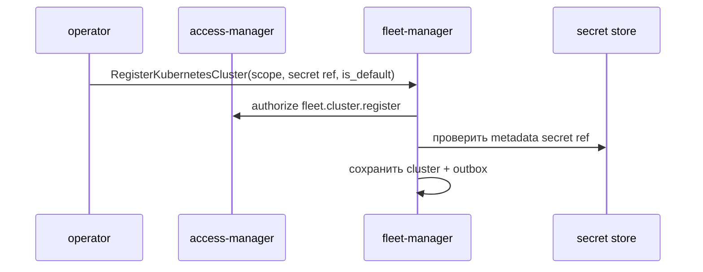
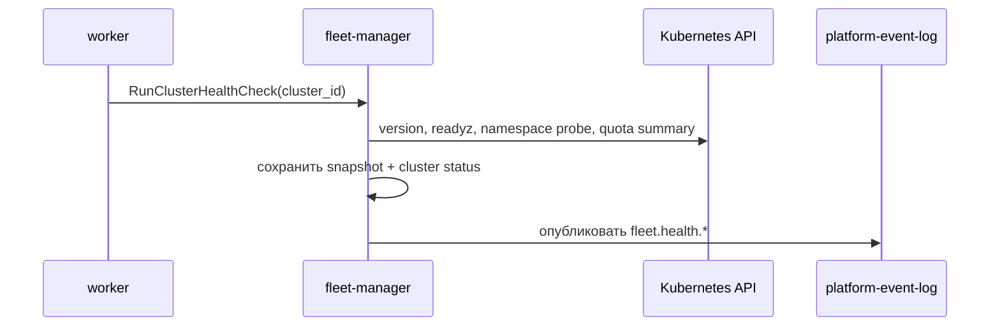
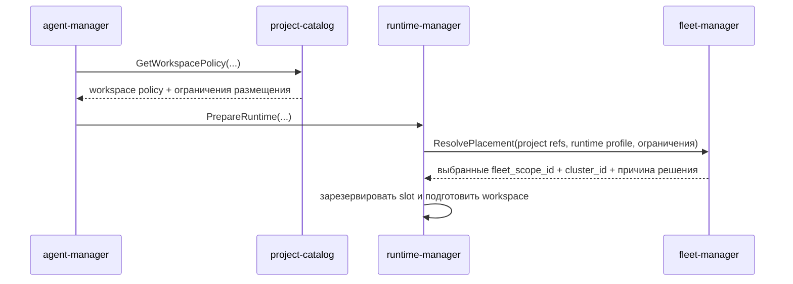

# Детальный дизайн: fleet-manager

## TL;DR

- Что меняем: выделяем `fleet-manager` как сервис-владелец серверов, Kubernetes-кластеров, связности, health и placement scope.
- Почему: `runtime-manager` должен исполнять на выбранном контуре, но не владеть реестром кластеров и не выбирать инфраструктуру сам.
- Основные компоненты: БД `fleet-manager`, gRPC API, outbox, fleet scope, server, Kubernetes cluster, проверка связности, health snapshot, placement rule и placement decision.
- Риски: превратить bootstrap seed в вечную одиночную модель, смешать runtime job и fleet health-check, начать хранить kubeconfig и состояние Kubernetes в БД.

## Цели

- Зафиксировать границу `fleet-manager` до контрактов и кода.
- Описать MVP как реестр нескольких fleet scope, серверов и Kubernetes-кластеров.
- Описать `platform-default` как bootstrap seed/fallback для одиночной установки, а не как ограничение MVP.
- Дать `runtime-manager` один понятный контракт для размещения слотов и jobs.
- Оставить runtime-нагрузки пакетов за `runtime-manager`: fleet только выбирает инфраструктурный контур.

## Не-цели

- Не реализовывать `fleet-manager` в стартовом срезе.
- Не менять `runtime-manager` без отдельной задачи.
- Не проектировать UI и gateway.
- Не хранить полную копию состояния Kubernetes API.
- Не управлять агентными `Run`, flow, prompt и acceptance.

## Граница сервисов

| Владеет `fleet-manager` | Не владеет |
|---|---|
| Fleet scope, server, Kubernetes cluster, ссылками на kubeconfig/secret, связностью, health snapshot, placement rule, placement decision и событиями `fleet.*`. | Жизненный цикл слота, статус job, workspace, результат build/deploy, установка пакета, agent run, provider-native объекты, project policy как истина. |

| Владеет `runtime-manager` | Как взаимодействует с fleet |
|---|---|
| Slots, workspace materialization, platform jobs, cleanup, prewarm и reuse. | Запрашивает `ResolvePlacement`, получает `fleet_scope_id`, `cluster_id` и объяснение решения, затем исполняет runtime на выбранном контуре. |

Главное правило: fleet выбирает и описывает инфраструктурный контур, runtime исполняет техническую работу на этом контуре.

## Компоненты

| Компонент | Назначение |
|---|---|
| `fleet-manager` | Сервис-владелец fleet-домена. |
| БД `fleet-manager` | Scope, servers, clusters, health snapshots, placement rules, журнал placement decisions и outbox. |
| Проверяющий связность Kubernetes | Проверяет доступность API server по ссылке на secret без сохранения kubeconfig в БД. |
| Сборщик health | Сохраняет ограниченный снимок состояния кластера, достаточный для размещения и оператора. |
| Resolver размещения | Выбирает cluster ref по ограничениям, policy, health и сигналам ёмкости. |
| Outbox-доставщик | Публикует `fleet.*` события через `platform-event-log`. |

## Статус реализации

FLEET-2 создаёт сервисный процесс `fleet-manager`, конфигурацию, gRPC-сервер, health/readiness, metrics, PostgreSQL-схему, repository-слой и локальный outbox. FLEET-3 реализует registry-команды и чтения для fleet scope, server и Kubernetes cluster, включая `platform-default` как данные реестра. Health-check и placement resolver остаются отдельными срезами FLEET-4 и FLEET-5.

## MVP-реестр нескольких кластеров

В MVP `fleet-manager` сразу поддерживает несколько fleet scope, server и Kubernetes cluster. Одиночная установка стартует с bootstrap seed, но оператор может зарегистрировать дополнительные серверы, scope и кластеры без изменения модели БД и API.

Bootstrap seed для одиночной установки:

- seed-запись `FleetScope` с `scope_type=platform` и `scope_key=platform-default`;
- seed-запись `KubernetesCluster`, связанная с этим scope;
- ссылка на secret с kubeconfig или учётными данными service account;
- статус `active` и `is_default=true` у scope и cluster;
- начальный health-статус `unknown` до первой проверки связности.

`platform-default` используется как seed/fallback, если других подходящих контуров нет или ограничения размещения не заданы. Он не должен быть единственным допустимым контуром в MVP. Целевой путь для `runtime-manager` — получить `fleet_scope_id` и `cluster_id` из `fleet-manager.ResolvePlacement`; runtime не выбирает cluster самостоятельно.

Запрещено:

- считать один кластер единственным возможным состоянием;
- хранить kubeconfig как text/blob в БД;
- размещать runtime по имени namespace без `fleet_scope_id` и `cluster_id`;
- делать runtime-нагрузку пакета прямым вызовом из fleet;
- вводить отдельный статус `placement_enabled`: размещение разрешается lifecycle-статусом `active`, правилами placement и health-снимком;
- откладывать реестр нескольких серверов, scope и кластеров на период после MVP.

## Модель размещения

Вход `ResolvePlacement`:

- `actor` и `source_service`;
- `runtime_profile`;
- project/repository/service refs;
- ограничения размещения из `project-catalog`;
- runtime-требования из `package-hub`, если запрос связан с пакетом или плагином;
- optional preferred fleet scope или cluster;
- требуемый режим: `code_only`, `full_env`, `read_only_production`, `platform_job`.

Выход:

- `placement_decision_id`;
- `fleet_scope_id`;
- `cluster_id`;
- выбранная namespace strategy;
- digest входных ограничений и версии правил;
- причина выбора или отказа;
- признак default path, если решение принято через bootstrap seed `platform-default`.

Placement decision не создаёт slot и не запускает job. Он фиксирует объяснимое решение размещения, которое исполняет `runtime-manager`.

## Основные потоки

### Регистрация bootstrap seed и дополнительных кластеров

### Проверка связности и health

Проверка хранит только ограниченный snapshot: статус, latency, короткую ошибку, capacity summary и timestamps. Полное состояние Kubernetes остаётся в Kubernetes и системах наблюдаемости.

### Размещение runtime

## Междоменные связи

| Домен | Связь |
|---|---|
| `runtime-manager` | Основной потребитель placement decisions; исполняет слоты/jobs на выбранном cluster ref. |
| `project-catalog` | Источник placement policy и service metadata. |
| `package-hub` | Источник runtime-требований для пакетов и плагинов. |
| `agent-manager` | Инициирует runtime через `runtime-manager`; прямой вызов fleet нужен только для административных сценариев. |
| `access-manager` | Проверяет права на fleet-операции и доступ к scope. |
| `operations-hub` | Получает события health/degradation для операторских экранов. |

## События

Минимальные будущие события:

- `fleet.scope.created`;
- `fleet.scope.updated`;
- `fleet.scope.disabled`;
- `fleet.scope.enabled`;
- `fleet.server.created`;
- `fleet.server.updated`;
- `fleet.server.disabled`;
- `fleet.server.enabled`;
- `fleet.cluster.created`;
- `fleet.cluster.updated`;
- `fleet.cluster.disabled`;
- `fleet.cluster.enabled`;
- `fleet.health.checked`;
- `fleet.health.degraded`;
- `fleet.placement.resolved`;
- `fleet.placement.rejected`.

События `runtime.*` не переносятся во fleet. Если runtime не смог создать namespace на выбранном cluster, это остаётся runtime-событием с ссылкой на `fleet_scope_id` и `cluster_id`.

## Конкурентные изменения

- Изменяемые агрегаты имеют `version`.
- Команды принимают `command_id`; update/delete операции принимают ожидаемую версию.
- Health check не держит SQL-блокировку на время обращения к Kubernetes.
- Placement resolver читает консистентный снимок правил и health, записывает decision log отдельной короткой транзакцией.

## Наблюдаемость

- Логи: cluster id, fleet scope, operation, actor, correlation id, decision id, result.
- Метрики: доступность кластеров, длительность health check, failed checks, доля отказов размещения, использование default path.
- Трейсы: входящий gRPC, проверка доступа, lookup metadata секрета, Kubernetes API probe, публикация outbox.
- Алерты: default cluster unavailable, repeated health degraded, placement reject spike, stale health snapshot.

## Риски

| Риск | Митигирующее решение |
|---|---|
| `fleet-manager` начнёт исполнять jobs. | В API fleet нет операций создания runtime jobs; он возвращает только placement decision. |
| Bootstrap seed станет вечным пределом. | `platform-default` оформлен как обычные данные реестра и fallback-причина решения, а не как скрытая конфигурация или единственный MVP-кластер. |
| Секреты попадут в БД. | Хранить только `secret_store_type` и `secret_store_ref`, значения получать через отдельный разрешённый клиент. |
| Health превратится в полную копию Kubernetes. | Хранить только ограниченный snapshot и ссылки на первоисточник. |
| Project policy начнёт дублироваться. | Fleet хранит placement rules только своего домена; проектная policy остаётся в `project-catalog`. |

## Апрув

- request_id: `owner-2026-05-11-fleet-manager-kickoff`
- Решение: approved
- Комментарий: дизайн `fleet-manager` согласован как стартовое целевое состояние FLEET-0.
