# C4 Container: kodex

## Кратко

Целевая платформа строится как набор сервисов-владельцев с моделью «БД на сервис». Пограничные компоненты остаются тонкими, исполнители не владеют доменной правдой, а операторский интерфейс получает агрегированную картину через проекции чтения.

## Контейнерные зоны

| Зона | Контейнеры | Ответственность |
|---|---|---|
| Пограничный слой и интерфейс | `web-console`, `user-gateway`, `staff-gateway`, `integration-gateway`, `platform-mcp-server` | Пользовательский интерфейс, входящие HTTP/webhook/MCP запросы, авторизация и маршрутизация по направлениям доступа. |
| Сервисы-владельцы | `access-manager`, `project-catalog`, `provider-hub`, `package-hub`, `agent-manager`, `fleet-manager`, `runtime-manager`, `billing-hub`, `interaction-hub`, `operations-hub` | Каноническое доменное состояние и бизнес-правила. |
| Исполнители | `worker`, `agent-runner` | Фоновые задачи, сверка и агентные сессии без владения доменной истиной. |
| Хранилища | PostgreSQL, Vault, объектное хранилище | Платформенное состояние, секреты, временные медиа. |
| Среда исполнения | Kubernetes, реестр контейнерных образов | Слоты, задания, нагрузки плагинов, проектные нагрузки и образы. |

## Диаграмма

```mermaid
C4Container
title kodex - контейнерная диаграмма

Person(user, "Пользователь", "Пользовательский интерфейс, голос, задачи и комментарии")
Person(owner, "Владелец", "Решения по контрольным точкам и релизам")
Person(operator, "Оператор", "Наблюдение и управление")

System_Ext(provider, "GitHub/GitLab", "Нативные артефакты провайдера")
System_Ext(k8s, "Kubernetes", "Среды исполнения и нагрузки")
System_Ext(registry, "Реестр контейнерных образов", "Образы")
System_Ext(vault, "Vault", "Секреты")
System_Ext(idp, "SSO/OIDC IdP", "Идентификация")
System_Ext(models, "Поставщики моделей", "API моделей")
System_Ext(channels, "Внешние каналы", "Уведомления и обратная связь")

System_Boundary(kodex, "kodex") {
  Container(web, "web-console", "Vue, PrimeVue", "Операторская и пользовательская консоль")
  Container(userGateway, "user-gateway", "Go", "HTTP-вход для внешних пользователей")
  Container(staffGateway, "staff-gateway", "Go", "HTTP-вход для сотрудников и администраторов")
  Container(integrationGateway, "integration-gateway", "Go", "Webhook и внешние интеграции")
  Container(mcp, "platform-mcp-server", "Go, MCP", "Инструментальная поверхность платформы")

  Container(access, "access-manager", "Go", "Пользователи, организации, группы, права, внешние аккаунты")
  Container(projects, "project-catalog", "Go", "Проекты, репозитории, services.yaml, релизные политики")
  Container(providerHub, "provider-hub", "Go", "Зеркало провайдера, webhook, лимиты, операции провайдера")
  Container(packageHub, "package-hub", "Go", "Пакеты, магазины, установка, версии")
  Container(agent, "agent-manager", "Go + LLM", "Процессы, роли, промпты, агентные запуски, приёмка")
  Container(fleet, "fleet-manager", "Go", "Серверы, кластеры, размещение")
  Container(runtime, "runtime-manager", "Go", "Слоты, задания, сборка, выкладка, очистка")
  Container(billing, "billing-hub", "Go", "Записи затрат, биллинговые аккаунты, счета")
  Container(interaction, "interaction-hub", "Go", "Диалоги, согласования, уведомления, каналы")
  Container(operations, "operations-hub", "Go", "Проекции чтения, операторские ленты, очереди")

  Container(worker, "worker", "Go", "Исполнитель фоновых задач и сверки")
  Container(runner, "agent-runner", "Контейнерный агент", "Исполнение ролевого агента внутри слота")

  ContainerDb(pg, "PostgreSQL-кластер", "PostgreSQL", "Хранилище по модели БД на сервис")
  ContainerDb(obj, "Объектное хранилище", "S3-compatible", "Временные голосовые и медиа-вложения")
}

Rel(user, web, "Работает", "HTTPS")
Rel(owner, web, "Принимает решения", "HTTPS")
Rel(operator, web, "Наблюдает", "HTTPS")
Rel(web, staffGateway, "Вызывает операторские и администраторские сценарии", "HTTPS")
Rel(web, userGateway, "Вызывает пользовательские сценарии", "HTTPS")
Rel(userGateway, idp, "OIDC auth", "HTTPS")
Rel(staffGateway, idp, "SSO/IAP/VPN auth", "HTTPS")
Rel(userGateway, access, "Команды и чтение доступа", "gRPC")
Rel(staffGateway, access, "Администрирование доступа", "gRPC")
Rel(staffGateway, projects, "Команды и чтение проектов", "gRPC")
Rel(staffGateway, agent, "Команды запусков и процессов", "gRPC")
Rel(staffGateway, interaction, "Команды диалогов и согласований", "gRPC")
Rel(staffGateway, operations, "Проекции для пользовательского интерфейса", "gRPC")
Rel(integrationGateway, providerHub, "Маршрутизация webhook", "gRPC")
Rel(agent, mcp, "Использует инструменты платформы", "MCP")
Rel(runner, mcp, "Использует инструменты платформы", "MCP")
Rel(mcp, access, "Маршрутизирует инструменты доступа", "gRPC")
Rel(mcp, projects, "Маршрутизирует инструменты проектов", "gRPC")
Rel(mcp, providerHub, "Маршрутизирует инструменты провайдера", "gRPC")
Rel(mcp, packageHub, "Маршрутизирует инструменты пакетов", "gRPC")
Rel(mcp, agent, "Маршрутизирует инструменты запусков и сессий для внешних вызывающих сторон", "gRPC")
Rel(mcp, fleet, "Маршрутизирует инструменты серверов и кластеров", "gRPC")
Rel(mcp, runtime, "Маршрутизирует инструменты среды исполнения", "gRPC")
Rel(mcp, billing, "Маршрутизирует инструменты биллинга", "gRPC")
Rel(mcp, interaction, "Маршрутизирует инструменты обратной связи и согласований", "gRPC")
Rel(mcp, operations, "Маршрутизирует инструменты операторского чтения", "gRPC")
Rel(projects, access, "Проверяет организацию и членство", "gRPC")
Rel(providerHub, access, "Получает разрешение на использование внешнего аккаунта", "gRPC")
Rel(packageHub, access, "Проверяет права установки", "gRPC")
Rel(agent, projects, "Получает рабочее пространство, область процесса и политику", "gRPC")
Rel(agent, providerHub, "Читает состояние провайдера и отправляет сигналы обновления", "gRPC")
Rel(agent, runtime, "Запрашивает слоты и задания среды исполнения", "gRPC")
Rel(agent, interaction, "Запрашивает обратную связь, согласования и уведомления", "gRPC")
Rel(runtime, fleet, "Получает правила размещения и контур кластера", "gRPC")
Rel(runtime, projects, "Читает политику репозитория и выкладки", "gRPC")
Rel(packageHub, providerHub, "Читает репозитории-источники пакетов", "gRPC")
Rel(billing, runtime, "Потребляет записи использования среды исполнения", "gRPC/events")
Rel(billing, packageHub, "Потребляет использование пакетов и ценовые данные", "gRPC/events")
Rel(operations, access, "Строит проекции доступа", "gRPC/events")
Rel(operations, projects, "Строит проекции проектов", "gRPC/events")
Rel(operations, providerHub, "Строит проекции провайдера", "gRPC/events")
Rel(operations, agent, "Строит проекции агентных запусков", "gRPC/events")
Rel(operations, runtime, "Строит проекции слотов и заданий", "gRPC/events")
Rel(operations, interaction, "Строит проекции согласований и уведомлений", "gRPC/events")
Rel(access, pg, "Своя БД", "SQL")
Rel(projects, pg, "Своя БД", "SQL")
Rel(providerHub, pg, "Своя БД", "SQL")
Rel(packageHub, pg, "Своя БД", "SQL")
Rel(agent, pg, "Своя БД", "SQL")
Rel(fleet, pg, "Своя БД", "SQL")
Rel(runtime, pg, "Своя БД", "SQL")
Rel(billing, pg, "Своя БД", "SQL")
Rel(interaction, pg, "Своя БД", "SQL")
Rel(operations, pg, "Своя БД проекций чтения", "SQL")
Rel(providerHub, provider, "Webhook, API и операции через CLI", "HTTPS")
Rel(runtime, k8s, "Управляет слотами и заданиями", "Kubernetes API")
Rel(runtime, registry, "Публикует и выкладывает образы", "OCI")
Rel(access, vault, "Проверяет ссылки на секреты платформы", "Vault API")
Rel(providerHub, vault, "Получает секрет по разрешённой ссылке", "Vault API")
Rel(interaction, channels, "Доставляет уведомления", "Контракты плагинов")
Rel(agent, models, "Использует модели", "API провайдера")
Rel(worker, access, "Исполняет назначенную фоновую работу", "gRPC")
Rel(worker, providerHub, "Сверка", "gRPC")
Rel(worker, runtime, "Платформенные задания", "gRPC")
Rel(runner, provider, "Работает с Issue, PR и комментариями", "gh/API")
Rel(interaction, obj, "Хранит ссылки на медиа", "S3 API")
```

## Сервисы-владельцы

| Сервис | Каноническая ответственность |
|---|---|
| `access-manager` | Пользователи, организации, группы, allowlist, разрешение SSO-principal, права, внешние аккаунты как субъекты политики, административный аудит. |
| `project-catalog` | Проекты, репозитории, проектная политика, `services.yaml`, источники проектной документации, правила веток, релизные политики, политика размещения. |
| `provider-hub` | Webhook, зеркальные проекции, синхронизация, лимиты, операции провайдера и операционное состояние авторизации по внешним аккаунтам. |
| `package-hub` | Каталог пакетов, установленные и доступные пакеты, источники магазинов, версии, верификация, секреты пакетов. |
| `agent-manager` | Процессы, этапы, роли, шаблоны промптов, агентные запуски, сессии, правила автоматизации, машина приёмки. |
| `fleet-manager` | Серверы, Kubernetes-кластеры, здоровье, связность, размещение. |
| `runtime-manager` | Слоты, платформенные задания, сборка, выкладка, зеркалирование, очистка, статус среды исполнения. |
| `billing-hub` | Биллинговые аккаунты, записи затрат, распределение затрат, основа счёта. |
| `interaction-hub` | Диалоговые ветки, согласования, уведомления, подписки, попытки доставки, обратные вызовы внешних каналов. |
| `operations-hub` | Модели чтения для пользовательского интерфейса, ленты событий, очереди, блокировки, агрегированные статусы. |

## Тонкие пограничные компоненты

- `web-console` не принимает доменных решений и не собирает состояние напрямую из БД нескольких сервисов-владельцев.
- `user-gateway`, `staff-gateway` и `integration-gateway` отвечают за входящий HTTP-трафик по своим направлениям, авторизацию, маршрутизацию, пограничную обработку webhook и ограничение частоты запросов на границе, но не хранят доменную правду.
- `platform-mcp-server` даёт инструментальную поверхность для agent-manager, агентов в слотах и внешних интеграций. Agent-manager и agent-runner обращаются к нему как клиенты MCP, а сам `platform-mcp-server` маршрутизирует разрешённые инструменты во все сервисы-владельцы по gRPC. Он не становится владельцем агентных запусков, заданий, состояния провайдера или проектов.

## Исполнители

- `worker` исполняет фоновую работу, повторы и сверку по поручению сервисов-владельцев.
- `agent-runner` исполняет ролевую агентную работу в слоте и возвращает результат через нативные артефакты провайдера и платформенные контракты.
- Исполнители не ходят напрямую в чужие БД и не вводят собственные канонические статусы.

## Хранилища

- PostgreSQL используется как общий инфраструктурный кластер, но данные разделены по сервисам-владельцам.
- Таблицы разных сервисов-владельцев не связываются через `FOREIGN KEY`, межбазовый join или каскадные операции.
- Vault хранит секреты платформы и её зависимостей; проекты могут использовать свои хранилища секретов.
- Полные технические логи остаются в контуре среды исполнения и логирования, а PostgreSQL хранит только краткие хвосты и диагностические выдержки.

## Апрув

- request_id: `owner-2026-04-26-platform-architecture-frame`
- Решение: approved
- Комментарий: C4-контейнеры входят в сквозной архитектурный каркас платформы.
