# C4 Container: kodex

## TL;DR

Целевая платформа строится как набор owner-сервисов с database-per-service моделью. Edge-компоненты остаются тонкими, executors не владеют доменной правдой, а operator UI получает агрегированную картину через read-проекции.

## Контейнерные зоны

| Зона | Контейнеры | Ответственность |
|---|---|---|
| Edge и UI | `web-console`, `api-gateway`, `platform-mcp-server` | Пользовательский UI, входящие HTTP/webhook/MCP запросы, авторизация и маршрутизация. |
| Owner-сервисы | `access-manager`, `project-catalog`, `provider-hub`, `package-hub`, `agent-manager`, `fleet-manager`, `runtime-manager`, `billing-hub`, `interaction-hub`, `operations-hub` | Каноническое доменное состояние и бизнес-правила. |
| Исполнители | `worker`, `agent-runner` | Фоновые задачи, reconciliation и агентные сессии без владения доменной истиной. |
| Хранилища | PostgreSQL, Vault, object storage | Платформенное состояние, секреты, временные медиа. |
| Runtime | Kubernetes, container registry | Slots, jobs, plugin workloads, project workloads и образы. |

## Диаграмма

```mermaid
C4Container
title kodex - Container Diagram

Person(user, "Пользователь", "UI, голос, задачи и комментарии")
Person(owner, "Owner", "Решения по gates и релизам")
Person(operator, "Оператор", "Наблюдение и управление")

System_Ext(provider, "GitHub/GitLab", "Provider-native artifacts")
System_Ext(k8s, "Kubernetes", "Runtime and workloads")
System_Ext(registry, "Container registry", "Images")
System_Ext(vault, "Vault", "Secrets")
System_Ext(idp, "SSO/OIDC IdP", "Identity")
System_Ext(models, "Model providers", "LLM APIs")
System_Ext(channels, "External channels", "Notifications and feedback")

System_Boundary(kodex, "kodex") {
  Container(web, "web-console", "Vue, PrimeVue", "Операторская и пользовательская консоль")
  Container(api, "api-gateway", "Go", "HTTP ingress, auth, routing, webhook edge")
  Container(mcp, "platform-mcp-server", "Go, MCP", "Инструментальная поверхность платформы")

  Container(access, "access-manager", "Go", "Пользователи, организации, группы, права")
  Container(projects, "project-catalog", "Go", "Проекты, репозитории, services.yaml, release policy")
  Container(providerHub, "provider-hub", "Go", "Provider mirror, webhooks, limits, external operations")
  Container(packageHub, "package-hub", "Go", "Пакеты, магазины, установка, версии")
  Container(agent, "agent-manager", "Go + LLM", "Flow, роли, prompts, runs, acceptance")
  Container(fleet, "fleet-manager", "Go", "Серверы, кластеры, placement")
  Container(runtime, "runtime-manager", "Go", "Slots, jobs, build, deploy, cleanup")
  Container(billing, "billing-hub", "Go", "Cost records, billing accounts, invoices")
  Container(interaction, "interaction-hub", "Go", "Dialogs, approvals, notifications, channels")
  Container(operations, "operations-hub", "Go", "Read-проекции, operator timelines, queues")

  Container(worker, "worker", "Go", "Background jobs and reconciliation executor")
  Container(runner, "agent-runner", "Containerized agent", "Role-agent execution inside slot")

  ContainerDb(pg, "PostgreSQL cluster", "PostgreSQL", "Database-per-service storage")
  ContainerDb(obj, "Object storage", "S3-compatible", "Temporary voice/media attachments")
}

Rel(user, web, "Работает", "HTTPS")
Rel(owner, web, "Принимает решения", "HTTPS")
Rel(operator, web, "Наблюдает", "HTTPS")
Rel(web, api, "Calls", "HTTPS")
Rel(api, idp, "OIDC auth", "HTTPS")
Rel(api, access, "Commands and reads", "HTTP/gRPC")
Rel(api, operations, "UI projections", "HTTP/gRPC")
Rel(api, providerHub, "Webhook routing", "HTTP/gRPC")
Rel(mcp, access, "Tool calls", "gRPC")
Rel(mcp, providerHub, "Provider tools", "gRPC")
Rel(mcp, agent, "Agent tools", "gRPC")
Rel(mcp, runtime, "Runtime tools", "gRPC")
Rel(mcp, interaction, "Feedback and approvals", "gRPC")
Rel(access, pg, "Own DB", "SQL")
Rel(projects, pg, "Own DB", "SQL")
Rel(providerHub, pg, "Own DB", "SQL")
Rel(packageHub, pg, "Own DB", "SQL")
Rel(agent, pg, "Own DB", "SQL")
Rel(fleet, pg, "Own DB", "SQL")
Rel(runtime, pg, "Own DB", "SQL")
Rel(billing, pg, "Own DB", "SQL")
Rel(interaction, pg, "Own DB", "SQL")
Rel(operations, pg, "Own read DB", "SQL")
Rel(providerHub, provider, "Webhook, API, CLI-backed operations", "HTTPS")
Rel(runtime, k8s, "Orchestrates slots and jobs", "Kubernetes API")
Rel(runtime, registry, "Publishes and deploys images", "OCI")
Rel(access, vault, "Reads platform secrets", "Vault API")
Rel(interaction, channels, "Delivers notifications", "Plugin contracts")
Rel(agent, models, "Uses models", "Provider API")
Rel(worker, access, "Executes assigned background work", "gRPC")
Rel(worker, providerHub, "Reconciliation", "gRPC")
Rel(worker, runtime, "Platform jobs", "gRPC")
Rel(runner, mcp, "Platform operations", "MCP")
Rel(runner, provider, "Issue/PR/comment work", "gh/API")
Rel(interaction, obj, "Stores media refs", "S3 API")
```

## Owner-сервисы

| Сервис | Каноническая ответственность |
|---|---|
| `access-manager` | Пользователи, организации, группы, allowlist, SSO principal resolution, права, административный аудит. |
| `project-catalog` | Проекты, репозитории, project policy, `services.yaml`, источники проектной документации, branch rules, release policy, placement policy. |
| `provider-hub` | Provider accounts, webhooks, зеркальные проекции, synchronization, rate limits, provider operations. |
| `package-hub` | Каталог пакетов, установленные и доступные пакеты, источники магазинов, версии, verification, секреты пакетов. |
| `agent-manager` | Flow, stage, role, prompt templates, runs, sessions, automation rules, acceptance machine. |
| `fleet-manager` | Серверы, Kubernetes-кластеры, health, connectivity, placement. |
| `runtime-manager` | Slots, platform jobs, build/deploy/mirror/cleanup, runtime status. |
| `billing-hub` | Billing accounts, cost records, распределение затрат, основа invoice. |
| `interaction-hub` | Dialog threads, approvals, notifications, subscriptions, delivery attempts, external channel callbacks. |
| `operations-hub` | Read-модели для UI, timelines, очереди, блокировки, агрегированные статусы. |

## Тонкие edge-компоненты

- `web-console` не принимает доменных решений и не собирает состояние напрямую из БД нескольких owner-сервисов.
- `api-gateway` отвечает за HTTP ingress, auth, routing, webhook edge и edge rate limiting, но не хранит доменную правду.
- `platform-mcp-server` даёт инструментальную поверхность для agent-manager и slot-агентов, но не становится владельцем run, jobs, provider state или проектов.

## Исполнители

- `worker` исполняет background work, retries и reconciliation по поручению owner-сервисов.
- `agent-runner` исполняет ролевую агентную работу в slot и возвращает результат через provider-native артефакты и платформенные контракты.
- Исполнители не ходят напрямую в чужие БД и не вводят собственные канонические статусы.

## Хранилища

- PostgreSQL используется как общий инфраструктурный кластер, но данные разделены по owner-сервисам.
- Таблицы разных owner-сервисов не связываются через `FOREIGN KEY`, cross-database join или каскадные операции.
- Vault хранит секреты платформы и её зависимостей; проекты могут использовать свои хранилища секретов.
- Полные technical logs остаются в runtime/logging-контуре, а PostgreSQL хранит только краткие хвосты и диагностические выдержки.

## Апрув

- request_id: `owner-2026-04-26-platform-architecture-frame`
- Решение: approved
- Комментарий: C4 container входит в сквозной архитектурный каркас платформы.
