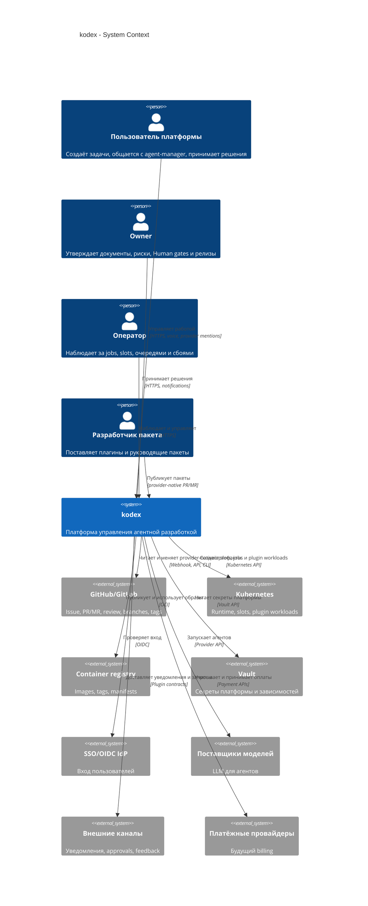

# C4 Context: kodex

## TL;DR

`kodex` — Kubernetes-first платформа управления агентной разработкой. Она не заменяет GitHub/GitLab, а управляет задачами, агентами, runtime, доступами, пакетами, релизами, уведомлениями и операторскими решениями поверх provider-native артефактов.

## Система в контуре

Платформа отвечает за:
- управление организациями, пользователями, группами и доступом;
- проекты, репозитории, проектную документацию и release policy;
- зеркальные проекции `Issue`, `PR/MR`, комментариев и связей;
- agent-manager, flow, роли, шаблоны промптов, runs и acceptance;
- slots, platform jobs, серверы, Kubernetes-кластеры и runtime-среды;
- пакетную платформу, плагины, пакеты руководящей документации и магазины пакетов;
- взаимодействие с человеком через UI, голос, уведомления и внешние каналы;
- биллинг, учёт затрат, риск, релизы и операционные витрины.

Платформа не становится владельцем:
- исходного состояния `Issue`, `PR/MR`, review, веток и тегов у провайдера;
- полного контейнерного лога и состояния Kubernetes workload;
- реестра образов как отдельной внутренней модели;
- содержимого проектной документации и кода вне разрешённых provider-native изменений.

## Участники

| Участник | Как взаимодействует с платформой |
|---|---|
| Пользователь платформы | Работает через web-console, голос, командный центр, задачи и комментарии провайдера. |
| Owner | Утверждает документы, high-risk переходы, Human gates и релизные решения по policy. |
| Оператор платформы | Следит за очередями, jobs, slots, кластерами, ошибками и уведомлениями. |
| Ролевой агент | Выполняет работу в slot, создаёт provider-native артефакты и использует платформенный MCP для разрешённых операций. |
| Agent-manager | Быстро управляет запросами, выбирает flow/роль, запускает ролевых агентов и принимает промежуточные решения. |
| Разработчик пакета | Поставляет plugin package, guidance package или пакет магазина по контракту пакетной платформы. |
| Администратор организации | Управляет пользователями, группами, внешними аккаунтами, проектами и инфраструктурными ограничениями. |

## Внешние системы

| Система | Роль |
|---|---|
| GitHub/GitLab | Provider-native рабочие артефакты: `Issue`, `PR/MR`, комментарии, review, ветки, теги и связи. |
| Kubernetes | Runtime для платформы, slots, plugin workloads и проектных окружений. |
| Container registry | Источник истины по образам, тегам и manifest. |
| Vault | Каноническое хранилище секретов платформы и её зависимостей. |
| Keycloak или другой IdP | Базовый SSO/OIDC-контур входа пользователей платформы. |
| Поставщики моделей | Модели для agent-manager, ролевых агентов и специализированных проверок. |
| Объектное хранилище | Временные голосовые и медиа-вложения, если они нужны для взаимодействия. |
| Внешние каналы | Telegram, email, webhooks и будущие каналы через пакеты и общий контракт взаимодействия. |
| Платёжные провайдеры | Будущий контур оплат и выставления счетов. |

## Диаграмма

## Границы ответственности

- Provider остаётся источником истины для рабочих артефактов.
- Kubernetes остаётся источником истины для runtime-объектов и полных логов.
- Платформа хранит каноническое состояние оркестрации, доступа, runtime lifecycle, acceptance, policy, биллинга, уведомлений и операторских проекций.
- UI питается от платформенных проекций и не должен читать провайдера напрямую на каждый экран.
- Slot-агент может работать через `gh` или API провайдера, но обязан передавать платформе идентификаторы созданных или изменённых артефактов как сигнал для синхронизации.

## Апрув

- request_id: `owner-2026-04-26-platform-architecture-frame`
- Решение: approved
- Комментарий: C4 context входит в сквозной архитектурный каркас платформы.
