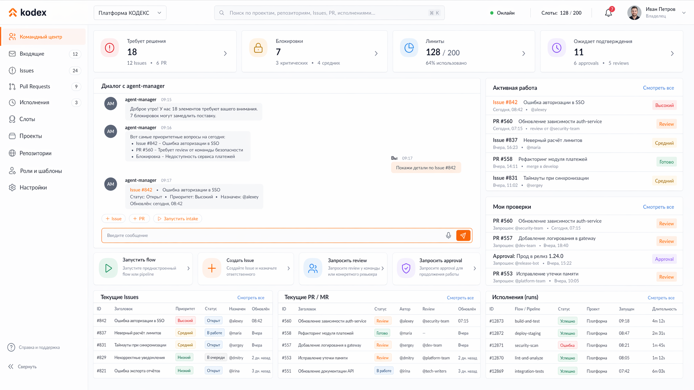
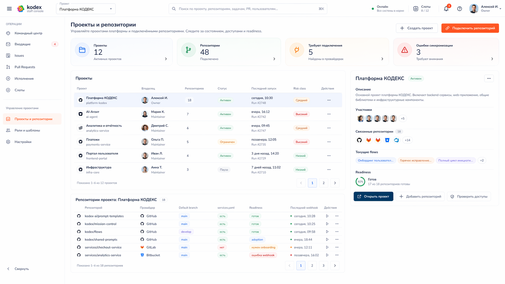

# Каноническая UX-модель консоли и рабочих режимов

## TL;DR
- Консоль строится не вокруг отдельной сущности "инициатива" или свободного полотна, а вокруг реальных сущностей платформы: проектов, репозиториев, `Issue`, `PR/MR`, agent `run`, platform `job`, агентных сессий и slot.
- Главная точка входа пользователя: командный центр с чатом и голосом для общения с agent-manager.
- Review `PR/MR` остаётся в GitHub/GitLab; консоль показывает состояние, проверки, gates и ссылки, но не пытается заменить нативный экран ревью провайдера.
- Для работы с задачами используется универсальное рабочее пространство `Issue`, а для работы с изменениями — универсальное рабочее пространство `PR/MR`.
- Конфигурирование flow, ролей, шаблонов промптов, внешних аккаунтов и каналов связи выносится в отдельный настроечный контур с репозиторий-ориентированным изменением через `PR`.
- Волна 5 закрывает проблему `time to first successful run`: первый запуск должен проходить через понятный управляемый маршрут, а не через скрытую платформенную магию.

## 1. Цель волны 5
Wave 5 должна зафиксировать не внешний стиль интерфейса, а продуктовую и операционную модель консоли:
- какие экраны вообще существуют;
- какую задачу решает каждый экран;
- на каких сущностях и проекциях он строится;
- где пользователь разговаривает с agent-manager;
- как оператор видит блокировки, уведомления, `run`, `job`, approvals и лимиты;
- как редактируются flow, роли и шаблоны промптов, если источником истины остаётся репозиторий.

## 2. Канонические UX-принципы

### 2.1. Никаких искусственных рабочих сущностей
Консоль не должна вводить параллельный внутренний мир наподобие "карточек инициатив", которыми невозможно нормально управлять через GitHub/GitLab.

Если пользователь видит в интерфейсе рабочий объект, он должен понимать, чем он является:
- проект;
- репозиторий;
- `Issue`;
- `PR/MR`;
- agent `run`;
- platform `job`;
- slot;
- approval или уведомление.

### 2.2. Чат — основной, но не единственный режим
Agent-manager — центральный способ запуска и продолжения работы, но пользователь не обязан решать всё только диалогом.

Консоль обязана давать:
- чат и голос как основной путь;
- явные кнопки запуска и создания;
- списки, фильтры и рабочие пространства для операторской навигации;
- быстрый переход в нативные для провайдера артефакты.

### 2.3. Один экран — одна доминирующая задача
Экран должен отвечать на один главный вопрос:
- что запустить;
- над чем поработать;
- что требует решения;
- что упало;
- что настроить.

Смешивать на одном уровне чат, хаотичное полотно, настройки и диагностику нельзя.

### 2.4. Review живёт у провайдера
GitHub/GitLab остаются местом, где:
- читается diff;
- пишутся review-комментарии;
- ставятся approval и merge-гейты.

Консоль должна:
- показывать сводку и блокировки;
- вести в нужный `Issue` или `PR/MR`;
- связывать review с `run`, `job`, risk class и acceptance state.

### 2.5. Операторские экраны строятся на проекциях чтения
Экран не должен собираться напрямую из нескольких случайных сервисов или из локального ad-hoc state.

Канонический путь:
- owner-сервисы владеют состоянием;
- `operations-hub` и другие проекционные контуры отдают готовые проекции чтения;
- `web-console` использует их как экранные модели.

### 2.6. Русский язык по умолчанию
Все пользовательские названия экранов, действий и статусов формулируются по-русски там, где это возможно без потери точности.

Английский сохраняется только для:
- нативных для провайдера объектов и системных имён;
- API/field names;
- code identifiers;
- модельных id и файловых путей.

## 3. Каноническая карта экранов

### 3.1. Верхний уровень навигации

| Раздел | Главный вопрос | Основные сущности |
|---|---|---|
| Командный центр | что запустить, что требует моего решения, что сказал agent-manager | agent-manager, запросы пользователя, approvals, уведомления |
| Проекты | какими проектами я управляю и в каком они состоянии | проект, права, сводка здоровья |
| Репозитории | какие репозитории подключены и готовы ли они к работе | репозиторий, состояние провайдера, предпроверка, статус принятия |
| Работа | какие `Issue` и `PR/MR` сейчас идут, заблокированы или ждут действия | `Issue`, `PR/MR`, risk class, gates, relationships |
| Исполнения | какие agent `run` и platform `job` выполняются или упали | `run`, `job`, slot, сводка действия и провайдера |
| Настройка | как определены flow, роли, шаблоны, аккаунты, каналы и доступы | flow, role profile, prompt template, external account, channel, membership |

### 3.2. Что запрещено выводить в отдельный верхнеуровневый раздел
Не должно быть самостоятельных верхнеуровневых экранов:
- для абстрактной "инициативы" как отдельной сущности;
- для свободного полотна как главного способа управления платформой;
- для документации как отдельного рабочего мира вне `Issue/PR/MR` и репозиториев.

## 4. Глобальные UX-примитивы

### 4.1. Глобальный контекст
На уровне приложения должны существовать:
- текущий пользователь;
- текущий проект или режим "все доступные проекты";
- универсальный поиск по задачам, `PR/MR`, `run`, `job` и репозиториям;
- глобальный центр внимания с непрочитанными решениями и ошибками.

### 4.2. Быстрые действия запуска
Вместо большого постоянного composer в центре экрана и отдельной доминирующей кнопки `Создать` в верхней панели консоль использует компактный блок быстрых действий внутри рабочего полотна командного центра.

Блок быстрых действий должен уметь:
- создать обычный `Issue`;
- создать `Issue` типа `initiative`;
- выбрать flow и запустить управляемое создание;
- открыть диалог с agent-manager в нужном контексте;
- инициировать репозиторный onboarding или adoption.

### 4.3. Голос как действие внутри диалогового контура
Голосовой запуск — не отдельный экран и не дублирующая кнопка в шапке.

Канонический паттерн:
- на экранах с agent-manager голос живёт внутри блока ввода сообщения;
- кнопка микрофона располагается в правой части поля ввода, рядом с отправкой;
- голос открывает тот же диалоговый контур agent-manager, что и текстовый ввод;
- голосовое действие не должно перекрывать полезный контент отдельной плавающей кнопкой на уровне всего экрана.

### 4.4. Центр внимания
Пользователь должен в любой момент видеть:
- pending approvals;
- запросы обратной связи;
- упавшие `run` и `job`;
- лимиты провайдера и ошибки авторизации;
- проблемы housekeeping и cleanup;
- важные завершения этапов.

Это не отдельная "сводка ради сводки", а слой навигации с явными действиями.

### 4.5. Активная работа и мои проверки
Командный центр должен разделять общий поток живой работы и персональную очередь решений текущего пользователя.

Канонические правила:
- `Активная работа` показывает свежие живые объекты в рамках текущего project scope: `Issue`, `PR/MR`, `run`, `job`;
- `Мои проверки` показывает только объекты, по которым текущее лицо должно принять решение, дать ответ или поставить review/approval;
- один и тот же объект не должен одновременно жить в обеих колонках;
- если объект требует действия именно от текущего пользователя, он попадает только в `Мои проверки`.

### 4.6. Активные элементы внутри сообщений
Сообщения agent-manager и других ролей могут содержать не только текст, но и встраиваемые action badges.

Канонические типы:
- badge-ссылка на `Issue` или `PR/MR` с иконкой перехода во внешнюю систему;
- badge-действие запуска или продолжения работы с иконкой запуска;
- badge-действие подтверждения или ответа, если оно не требует полного перехода в отдельный экран.

## 5. Командный центр как домашний экран
Командный центр — это главный домашний экран платформы.

Его состав:
1. центральный диалог с agent-manager;
2. блок быстрых действий для типовых сценариев запуска;
3. виджеты центра внимания;
4. отдельные колонки `Активная работа` и `Мои проверки` без дублей;
5. быстрые переходы к проектам, репозиториям и рабочим пространствам.

Командный центр не должен:
- показывать свободное полотно;
- дублировать полное содержимое рабочих пространств;
- быть второй версией GitHub board.

## 6. Универсальные рабочие пространства

### 6.1. Рабочее пространство `Issue`
Один канонический экран для любой задачи:
- `initiative`;
- этапная задача;
- follow-up;
- `risk`;
- `incident`;
- `self-improve`.

Разница определяется типом задачи и связанными артефактами, а не отдельными экранами разных сущностей.

### 6.2. Рабочее пространство `PR/MR`
Отдельный канонический экран нужен только потому, что `PR/MR` имеет другой цикл:
- review;
- merge readiness;
- связи с `Issue`;
- связь с `run`, `job`, risk class, release и acceptance evidence.

### 6.3. Рабочее пространство исполнения
Agent `run` и platform `job` не становятся предметом управления на домашнем экране, но у них должен быть собственный диагностический экран:
- статус;
- контекст;
- причина ошибки;
- короткий хвост лога;
- ссылка на первоисточник;
- следующий ожидаемый action.

## 7. Что фронтенд обязан помнить об источнике истины

### 7.1. Что является первичным
Первичными остаются:
- нативные для провайдера артефакты в GitHub/GitLab;
- owner-сервисы платформы;
- репозиторий платформы для flow, ролей и шаблонов промптов.

### 7.2. Что хранится только как экранная проекция
Фронтенд работает с:
- проекциями чтения для экранов;
- агрегированными сводками;
- статусными проекциями;
- поисковыми индексами;
- локальным экранным state.

Он не создаёт собственную канонику поверх этих данных.

## 8. Ограничения на визуальную модель

### 8.1. Canvas не является главным способом управления
Свободное перемещение нод и хаотичный граф не могут быть источником истины для работы пользователя.

Canvas допускается только как:
- вспомогательный просмотр потока;
- объясняющая схема;
- вспомогательный режим анализа.

### 8.2. Flow-редактор не должен требовать "рисовать схему руками"
Для настройки flow и ролей каноническим считается последовательный UX, а не произвольный редактор нод.

## 9. Импликации для frontend-реализации

### 9.1. Базовый UI-kit
Для новой версии `web-console` базовым UI-kit считается PrimeVue.

Это решение означает:
- повторно используемые примитивы должны быть собраны поверх PrimeVue в `shared/ui`;
- экранная логика и доменные модели не должны смешиваться с конкретными компонентами библиотеки;
- визуальный слой можно менять без перелома продуктовой модели экранов.

### 9.2. Роуты и stores
Frontend обязан отражать каноническую карту экранов:
- route-level страницы на уровне разделов;
- stores по конкретным рабочим поверхностям;
- typed mappings между API DTO и UI-моделями;
- единый error model и единый notification model.

## 10. Текущий макет командного центра

Для текущей итерации wave 5 каноническим базовым направлением считается макет командного центра с:
- верхней лентой решений и активной работы;
- основным диалогом слева;
- правой колонкой `Активная работа` и `Мои проверки` без дублей;
- отдельным блоком быстрых действий внутри основного рабочего полотна;
- action badges внутри сообщений agent-manager вместо лишних глобальных кнопок в шапке.

Спецификация экрана: [screen.md](images/wave5/01-command-center/screen.md)

## 11. Текущий макет проектов и репозиториев

Для текущей итерации wave 5 базовым направлением считается экран проектов и репозиториев с:
- верхней лентой summary-card по числу проектов, репозиториев, подключений и ошибок синхронизации;
- таблицей проектов как основным рабочим списком;
- правой панелью деталей выбранного проекта;
- отдельным блоком репозиториев выбранного проекта;
- явными действиями подключения репозитория и проверки доступов.

Спецификация экрана: [screen.md](images/wave5/08-projects-and-repositories/screen.md)

## 12. Что wave 5 intentionally не фиксирует
В этой волне не фиксируются:
- финальный визуальный стиль и язык анимаций;
- точная сетка компонентов PrimeVue;
- окончательный OpenAPI экранных ручек;
- детали реализации голосового распознавания;
- детальный onboarding runtime и bootstrap-контур.

Но любая последующая реализация `web-console` обязана соответствовать канонике этой волны: командный центр как главный вход, универсальные рабочие пространства, операторские поверхности на реальных сущностях и репозиторий-ориентированная настройка flow/ролей/шаблонов.
