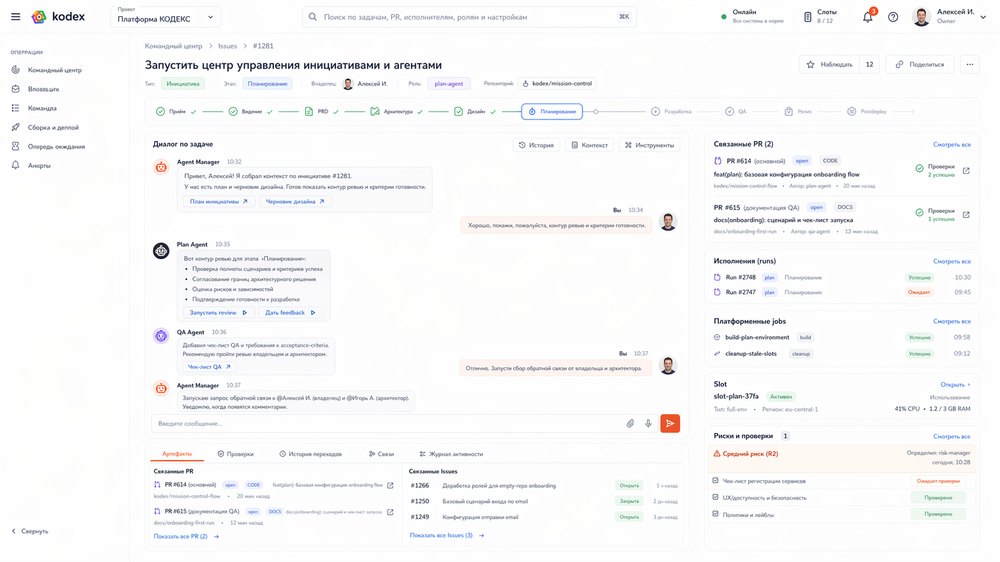
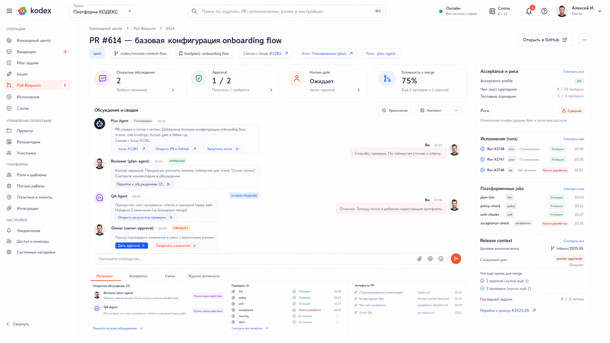
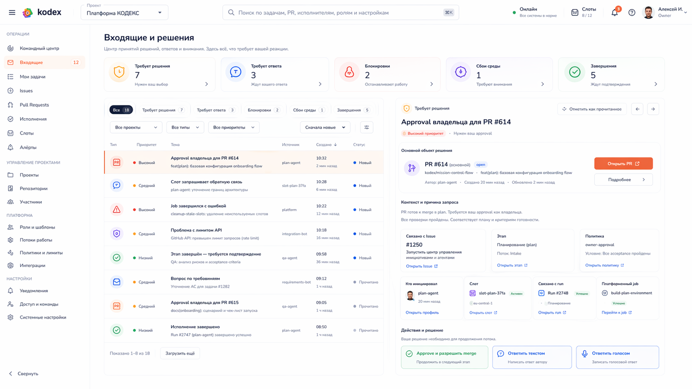
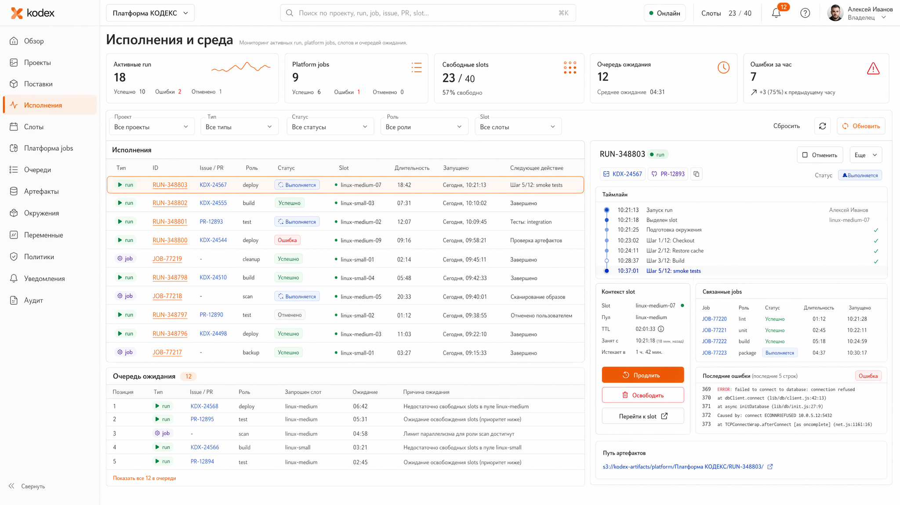
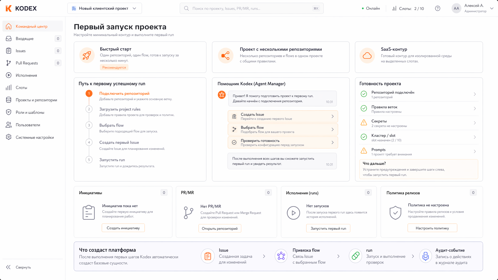

# Рабочие пространства, первый запуск и операторские поверхности

## TL;DR
- Главный рабочий объект пользователя — не абстрактная "инициатива", а универсальное рабочее пространство `Issue` или `PR/MR`.
- Командный центр и центр внимания помогают понять, что делать дальше, но основная работа разворачивается в конкретном `Issue` или `PR/MR`.
- Wave 5 канонически закрывает проблему `time to first successful run`: первый запуск проектируется как управляемый маршрут с тремя дорожками — пустой репозиторий, существующий репозиторий и уже подготовленный репозиторий.
- Уведомления, approvals, сбои `run/job`, лимиты провайдера и ошибки housekeeping должны сходиться в единый операторский раздел входящих, а не расползаться по отдельным не связанным экранам.
- Артефакты внутри рабочей поверхности — это прежде всего `Issue`, `PR/MR`, комментарии, approvals, `run`, `job`, slot и evidence summaries; файлы документации не становятся отдельной первичной сущностью UI.

## 1. Универсальное рабочее пространство `Issue`

### 1.1. Зачем нужен единый экран задачи
Пользователь не должен выбирать между разными экранами "инициативы", "этапа", "follow-up" и "инцидента".

Все эти объекты являются `Issue` с разными типами, поэтому консоль должна давать единый рабочий каркас, который меняет содержимое в зависимости от:
- типа задачи;
- текущего этапа flow;
- связанных `PR/MR`;
- risk class;
- наличия `run`, `job` и slot;
- наличия ожидающего Human gate.

### 1.2. Канонические секции рабочего пространства `Issue`

| Секция | Что показывает | На чём основана |
|---|---|---|
| Summary | тип задачи, текущий статус, следующий шаг, риск, владелец решения | состояние провайдера + проекция `agent-manager`/`operations-hub` |
| Conversation | диалог по задаче, контекст agent-manager, комментарии провайдера, текстовый и голосовой ввод, action badges внутри сообщений | комментарии провайдера + проекция взаимодействия |
| Связанные артефакты | связанные `PR/MR`, follow-up `Issue`, approvals, evidence summaries | provider relationships + acceptance projection |
| Проверки и решения | статус приёмки, роли reviewer/`qa`/управления рисками, ожидающий Human gate | `agent-manager`, governance projection |
| Исполнения | agent `run`, platform `job`, сводка по slot | `runtime-manager` + `operations-hub` |
| Среда | slot, режим запуска, reuse, ссылка на диагностику | `runtime-manager` |

### 1.2.1. Как показываются связанные `PR/MR`
Одна `Issue` может иметь более одного связанного `PR/MR`.

Поэтому канонический экран должен показывать:
- список связанных `PR/MR`;
- явное выделение основного `PR/MR` текущего этапа, если он определён flow-правилами;
- статусы проверок и review по каждому `PR/MR` отдельно;
- быстрый переход в GitHub/GitLab по каждому связанному артефакту;
- отдельную кнопку внешнего перехода на уровне каждого `PR/MR` и связанного `Issue`, а не одну общую кнопку на весь блок.

### 1.2.2. Что означают нижние вкладки рабочего пространства
Нижний блок рабочего пространства должен иметь устойчивую семантику:
- `Артефакты` — связанные `Issue`, `PR/MR`, approvals и evidence summaries;
- `Проверки` — acceptance state, результаты ролей проверки, обязательные Human gate и решения по ним;
- `История переходов` — история движения по этапам flow;
- `Связи` — relationships между `Issue`, `PR/MR`, `run`, `job`, slot и release-контекстом;
- `Журнал активности` — единая лента событий по задаче, агентам, provider-комментариям, `run`, `job` и ручным решениям.

Правило для вкладок рабочего пространства:
- на экране одновременно показывается содержимое только одной нижней вкладки;
- summary, conversation и верхние контекстные блоки остаются общими;
- вкладки не должны дублировать одно и то же содержимое разными словами.

### 1.3. Что нельзя тащить в рабочее пространство `Issue`
Нельзя превращать рабочее пространство задачи:
- в полную копию diff review;
- в вторую систему управления документацией;
- в свободное полотно как основной режим работы;
- в длинную "панель-свалку" без следующего действия.

## 2. Универсальное рабочее пространство `PR/MR`

### 2.1. Почему нужен отдельный экран
`PR/MR` живёт в другой логике, чем задача:
- есть review state;
- есть merge readiness;
- есть checks и gates;
- есть связь с release и postdeploy-контуром.

### 2.2. Канонические секции рабочего пространства `PR/MR`

| Секция | Что показывает |
|---|---|
| Summary | заголовок, связанный `Issue`, статус ревью, готовность к merge |
| Сводка ревью | открытые треды, approvals, обязательные Human gate, кто ещё должен посмотреть |
| Acceptance и risk | статус машины приёмки, risk class, blockers |
| Исполнения | связанные `run`, `job`, slot и линия build/deploy |
| Release context | если `PR/MR` участвует в release-контуре — какой следующий gate и что ещё нужно |
| Переход в провайдера | явная ссылка на GitHub/GitLab для чтения diff и review |

### 2.3. Чего здесь не должно быть
Рабочее пространство `PR/MR` не должно пытаться заменить нативный review интерфейс провайдера.

Его задача:
- дать платформенный контекст;
- показать блокировки;
- привести к правильному месту в GitHub/GitLab;
- вернуть пользователя обратно в операторский контур.

### 2.4. Активные элементы в рабочем пространстве `PR/MR`
Внутри сводки и обсуждения рабочего пространства `PR/MR` допускаются action badges:
- открыть связанный `Issue` или `PR/MR` у провайдера;
- запустить revise;
- дать approval или перейти к Human gate;
- перейти к связанному `run` или `job`.

При этом action badges не должны маскировать главный принцип экрана: diff review и thread-by-thread разбор остаются у провайдера.

### 2.5. Контекст approval в рабочем пространстве `PR/MR`
Если approval относится именно к `PR/MR`, экран должен показывать это явно:
- связанный `PR/MR` визуально выделяется как объект решения;
- основная контрастная action-кнопка ведёт к `PR/MR` у провайдера;
- статусы `approved`, `нужно решение`, `ожидает` привязываются к конкретному сообщению, review-сводке или Human gate, а не висят как плавающие бейджи без контекста.

### 2.6. Компактная хронология в рабочем пространстве `PR/MR`
Лента обсуждения в `PR/MR workspace` должна оставаться короткой и читаемой.

Канонические правила:
- в основном состоянии показываются 3-4 ключевых сообщения или summary-card;
- порядок сообщений строго хронологический;
- роли и авторы визуально не путаются между собой;
- status chips размещаются внутри конкретной карточки сообщения, review summary или Human gate.

Нижние вкладки `PR/MR` подчиняются той же модели:
- каждая вкладка показывает отдельный устойчивый срез;
- экран не должен одновременно показывать сводку одной вкладки и детальный контент другой.

## 3. Командный центр

### 3.1. Что делает командный центр
Командный центр — это домашний экран и постоянный пульт работы с agent-manager.

Он отвечает на три вопроса:
1. что я хочу сделать;
2. что платформа от меня сейчас ждёт;
3. что завершилось, упало или заблокировалось.

### 3.2. Канонический состав командного центра
- основной чат с agent-manager;
- история последних диалогов и возобновляемых сессий;
- блок быстрых действий внутри основного полотна;
- голосовой запуск;
- виджеты центра внимания;
- раздельные блоки `Активная работа` и `Мои проверки`;
- переходы в `Issue`, `PR/MR`, `run`, `job` и настройки.

### 3.3. Как пользователь запускает работу
Канонические способы:
- текстом или голосом в чате agent-manager;
- через блок быстрых действий в командном центре;
- через переход из существующего `Issue` или `PR/MR`;
- через внешнюю интеграцию по единому контракту;
- через mention в GitHub/GitLab.

## 4. Центр внимания, входящие и уведомления

### 4.1. Зачем нужен единый раздел входящих
Оператор не должен искать по нескольким разделам:
- где застрял approval;
- где упала cleanup `job`;
- где истёк rate limit;
- где ждут human feedback;
- где завершился важный этап.

Поэтому в wave 5 обязательна единая поверхность внимания.

### 4.2. Канонические категории входящих

| Категория | Примеры |
|---|---|
| Требует решения | release gate, high-risk gate, product approval |
| Требует ответа | вопрос от agent-manager, feedback request из slot |
| Блокировки | failed acceptance, missing artifact, rate limit, auth failure |
| Сбои среды | failed build/deploy/cleanup/health-check `job` |
| Завершения | этап завершён, release дошёл до `stable`, adoption завершён |

### 4.3. Требования к уведомлениям
Уведомление должно не просто сообщать о событии, а вести к действию:
- открыть нужный `Issue`;
- открыть `PR/MR`;
- перейти к `run/job`;
- подтвердить gate;
- дать feedback;
- перейти к настройке внешнего аккаунта или лимитов.

### 4.4. Правая панель деталей входящего
Экран входящих должен иметь выделенную панель деталей выбранного элемента.

В ней обязательно показываются:
- связанный `Issue`, `PR/MR`, `run`, `job` или slot;
- краткое объяснение, почему элемент попал во входящие;
- evidence summary или краткий статус проверки;
- явные действия: approval, ответ, переход в `run/job`, переход к настройке аккаунта или лимита.

### 4.5. Как выбирается элемент входящего
Основной паттерн работы со входящими:
- клик по элементу списка открывает правую панель деталей;
- список сам по себе не дублирует основные действия из правой панели;
- если входящее требует решения по `PR/MR`, правая панель явно подсвечивает этот `PR/MR` и даёт контрастный переход к нему;
- если входящее требует ответа, правая панель открывает текстовый или голосовой маршрут ответа, а не только набор формальных кнопок.

### 4.6. Ответ текстом и голосом
Если элемент требует ответа, а не формального approval, канонический паттерн такой:
- пользователь выбирает действие `Ответить`;
- платформа открывает модальный диалог ответа;
- внутри модального диалога доступны текстовый ввод и голосовой захват;
- после подтверждения ответ публикуется в нужный контекст: `Issue`, `PR/MR`, `run`, slot или другой связанный объект.

### 4.7. Контекст approval во входящих
Если входящее требует approval именно для `PR/MR`, правая панель должна показывать:
- что approval относится к конкретному `PR/MR`;
- компактную summary-сводку проверки;
- контрастную основную кнопку перехода к `PR/MR`;
- отдельное решение пользователя, если approval допускается прямо из платформы.

### 4.8. Навигация по связанным сущностям
В панели деталей входящего карточки связанных сущностей должны быть интерактивными:
- агент, slot и `run` открываются как отдельные сущности платформы;
- `Issue` и `PR/MR` ведут в соответствующие рабочие пространства или во внешний provider UI;
- карточка не должна быть просто текстовой сводкой без перехода.

## 4.9. Экран исполнений и slot-действия
В операционном экране исполнений slot-контекст должен давать не только статус, но и явные действия:
- `Продлить` lease slot;
- `Освободить` slot;
- `Перейти к slot`.

Эти действия живут рядом с TTL и состоянием reuse, а не скрываются в общем меню.

### 4.10. Компоновка экрана исполнений
Экран исполнений строится как плотная двухколоночная поверхность:
- верхняя лента счётчиков занимает всю ширину страницы;
- ниже располагаются таблица исполнений и правая диагностическая панель;
- правая панель по высоте визуально читается как парная область к таблице, а не как отдельная короткая карточка;
- slot-контекст и связанные jobs входят в состав той же диагностической панели.

## 5. Артефакты в UI

### 5.1. Что считается первичным артефактом
В интерфейсе первичными считаются:
- `Issue`;
- `PR/MR`;
- структурированные комментарии;
- approvals;
- `run`;
- `job`;
- сводка по slot;
- сводка подтверждений.

### 5.2. Что не считается первичным артефактом
Файлы документации сами по себе не становятся отдельной рабочей сущностью UI.

Они живут:
- в репозитории;
- в `PR/MR`;
- в ссылках и evidence summaries;
- в follow-up задачах и открытых инструкциях.

Если оператору нужно понять состояние документационного шага, он идёт через:
- связанный `Issue`;
- связанный `PR/MR`;
- сводка приёмки.

## 6. Первый запуск и `time to first successful run`

### 6.1. Каноническая метрика
Для wave 5 фиксируется продуктовая метрика:
- `time to first successful run`.

Она измеряет путь от первого осознанного действия пользователя в подключённом проекте до первого успешно завершённого управляемого агентного запуска.

### 6.2. Три канонические дорожки

| Дорожка | Когда применяется | Связанные reference issues |
|---|---|---|
| Empty repository onboarding | репозиторий пустой или почти пустой | `#281`, `#309` |
| Existing repository adoption | код и документы уже существуют, но проект ещё не принят платформой | `#282`, `#309` |
| Ready repository first task | репозиторий уже готов к управляемой работе | `#309` |

### 6.3. Empty repository onboarding
Пользователь должен пройти понятный управляемый маршрут:
1. подключить репозиторий;
2. пройти preflight;
3. получить предложение agent-manager создать базовые project rules, документацию и первый flow;
4. выбрать минимальный сценарий первого запуска;
5. получить первый `Issue` и первый успешный `run`.

Старт маршрута должен читаться через:
- первый шаг в stepper;
- действия agent-manager внутри экрана;
- empty-state карточки текущего состояния.

Отдельная доминирующая CTA-кнопка в правом верхнем углу не является обязательной и не должна дублировать эти действия.

### 6.4. Existing repository adoption
Платформа должна:
1. показать, что уже найдено в репозитории;
2. указать, чего не хватает для управляемой работы;
3. предложить агенту подготовить adoption-задачу и рекомендации;
4. довести пользователя до первого управляемого запуска без ручной сборки скрытой конфигурации.

### 6.5. Ready repository first task
Если репозиторий уже готов:
1. пользователь заходит в командный центр;
2. выбирает быстрое действие или пишет agent-manager;
3. создаётся или выбирается нужный `Issue`;
4. запускается flow или прямой `run`;
5. пользователь видит ход исполнения через рабочее пространство и входящие.

### 6.6. Что wave 5 закрывает по `#309`
Wave 5 закрывает проблему первого запуска на уровне UX-модели:
- где начинается путь пользователя;
- какие управляемые маршруты обязательны;
- как это связано с проектами, репозиториями и agent-manager;
- как измеряется первый успешный запуск.

Детали реализации onboarding остаются для следующих execution waves по `#281` и `#282`.

## 7. Отвергнутые UX-паттерны

### 7.1. Большой постоянный composer на главной
Отклоняется, потому что:
- съедает место;
- быстро превращается в дублирование чата;
- плохо масштабируется на голос, управляемое создание и быстрые действия.

### 7.2. Отдельный экран "инициативы"
Отклоняется, потому что инициатива уже является `Issue` типа `initiative`.

### 7.3. Свободное полотно как основной рабочий экран
Отклоняется, потому что:
- плохо управляется;
- не даёт стабильного layout;
- мешает опираться на реальные сущности и следующие действия.

## 8. Текущий макет рабочего пространства `Issue`

Для текущей итерации wave 5 базовым направлением считается рабочее пространство `Issue` с:
- горизонтальной stage-линией;
- основным диалогом и action-полосой в центре;
- отдельным блоком связанных `PR/MR`, а не одного `PR`;
- badge-действиями внутри сообщений агента и маленькими внешними переходами у каждого артефакта;
- нижними вкладками с устойчивой семантикой артефактов, проверок, связей и истории.

Спецификация экрана: [screen.md](images/wave5/02-issue-workspace/screen.md)

## 9. Текущий макет рабочего пространства `PR/MR`

Для текущей итерации wave 5 базовым направлением считается рабочее пространство `PR/MR` с:
- верхней summary-полосой review state, approvals, Human gate и merge readiness;
- центральной лентой обсуждения и review-сводок вместо попытки встроить diff review;
- компактной ссылкой во внешний provider UI;
- правой колонкой `Acceptance и риск`, `Исполнения`, `Платформенные jobs` и `Release context`;
- нижними вкладками для проверок, acceptance, связей и журнала активности.

Спецификация экрана: [screen.md](images/wave5/05-pr-workspace/screen.md)

## 10. Текущий макет входящих и решений

Для текущей итерации wave 5 базовым направлением считается единый экран входящих с:
- верхней лентой категорий `Требует решения`, `Требует ответа`, `Блокировки`, `Сбои среды`, `Завершения`;
- основной очередью операторских элементов;
- отдельной панелью деталей выбранного входящего;
- action-кнопками и badges, которые ведут к решению, а не только сообщают о событии.

Спецификация экрана: [screen.md](images/wave5/06-inbox-and-approvals/screen.md)

## 11. Текущий макет исполнений и среды

Для текущей итерации wave 5 базовым направлением считается операционный экран исполнений с:
- верхней лентой счётчиков по `run`, platform `job`, slot и очереди;
- плотным списком/таблицей исполнений;
- правой панелью диагностики выбранного элемента;
- slot-контекстом и связанными jobs;
- только коротким хвостом лога вместо длинного raw-log режима.

Спецификация экрана: [screen.md](images/wave5/07-executions-jobs-slots/screen.md)

## 12. Текущий макет первого запуска и empty states

Для текущей итерации wave 5 базовым направлением считается onboarding-экран с:
- переключателем трёх дорожек первого запуска;
- вертикальным путём к первому успешному `run`;
- компактным блоком agent-manager с action badges;
- правой панелью readiness и найденных проблем;
- отдельными empty states для репозиториев, flow и запусков.

Спецификация экрана: [screen.md](images/wave5/11-onboarding-and-empty-states/screen.md)

## 13. Что wave 5 deliberately не фиксирует
В этой волне не фиксируются:
- детальные wireframes;
- финальная визуальная иерархия PrimeVue-компонентов;
- точные SLA по уведомлениям;
- окончательный синтаксис поиска;
- финальная структура route names.

Но любая реализация обязана сохранить канонику: единое рабочее пространство `Issue`, отдельное рабочее пространство `PR/MR`, командный центр как домашний экран, единый раздел входящих и управляемый маршрут первого запуска.
