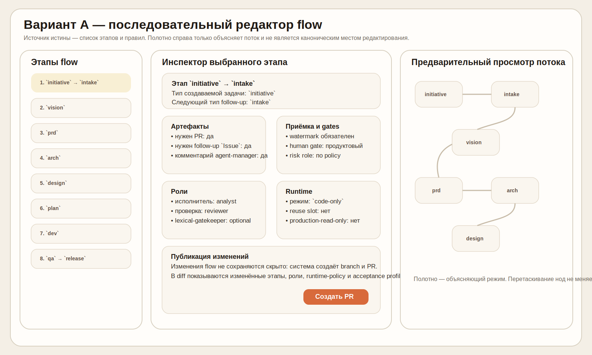
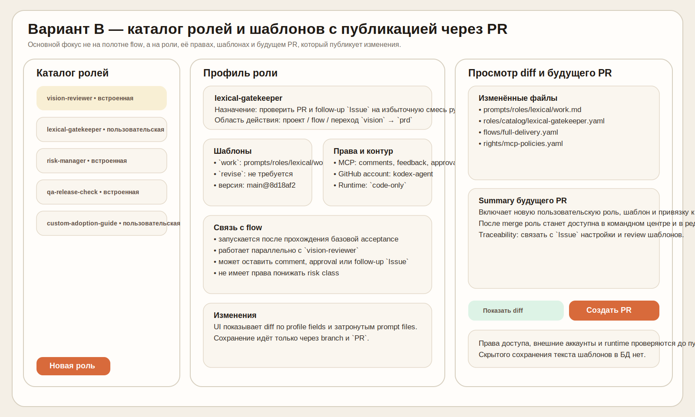

# UX редактирования flow, ролей, шаблонов промптов и настроек платформы

## TL;DR
- Канонический UX настройки строится не вокруг произвольного полотна, а вокруг последовательного редактирования сущностей с понятным предварительным просмотром.
- Flow редактируется как упорядоченная схема этапов и правил, а графическое представление допускается только как вспомогательный просмотр.
- Роли и шаблоны промптов разделены: профиль роли и политика исполнения живут в платформе, а канонический текст шаблона — в репозитории платформы.
- Пользовательские роли поддерживаются наравне со встроенными, но проходят тот же контур политик прав, MCP-доступов, аккаунтов и review.
- UI может запускать редактирование шаблонов, flow и ролевых политик, но публикует изменения через обычный `PR`, а не через "магическое сохранение в БД".

## 1. Почему нужен последовательный подход
Flow платформы — это не произвольный граф чего угодно.

В канонической модели flow состоит из:
- этапов;
- правил входа;
- обязательных артефактов;
- контрольных точек;
- дополнительных ролей проверки;
- правил перехода;
- политики исполнения.

Такую модель надёжнее и понятнее редактировать как последовательность с инспектором правил, а не как свободно размещаемые ноды.

## 2. Канонический UX редактора flow

### 2.1. Главный режим
Основной редактор flow должен состоять из трёх связанных областей:
1. список этапов и переходов;
2. инспектор выбранного этапа или правила;
3. предварительный просмотр структуры потока.

Источник истины — список этапов и набор правил, а не расположение на полотне.

### 2.2. Что настраивается в этапе

| Блок | Что настраивается |
|---|---|
| Идентичность этапа | ключ этапа, название, описание, тип создаваемой задачи |
| Артефакты | нужен ли `PR/MR`, нужен ли follow-up `Issue`, нужны ли структурированные комментарии |
| Приёмка | профиль приёмки, требования к watermark, обязательные проверки |
| Контрольные роли | reviewer, `qa`, роль управления рисками, пользовательские контрольные роли |
| Human gates | где нужен человек и какой тип решения требуется |
| Runtime | `code-only`, `full-env`, reuse slot, production-read-only |
| Переход | следующий этап, ветвление, условия остановки, логика follow-up |

### 2.3. Просмотр потока
Графический просмотр допустим, но:
- не является единственным местом редактирования;
- строится автоматически;
- не зависит от ручного раскладывания нод;
- служит для понимания структуры, а не для ввода канонических данных.

### 2.4. Что запрещено в редакторе flow
Запрещено:
- делать свободное позиционирование источником истины;
- смешивать flow-логику с runtime-диагностикой;
- хранить необязательный визуальный шум вместо правил перехода.

## 3. Каталог ролей

### 3.1. Что должен показывать каталог ролей
Каталог ролей — это не список prompt-файлов, а реестр профилей ролей.

Для роли должны быть видны:
- встроенная или пользовательская;
- ключ роли;
- назначение;
- область действия;
- обязательный `work`-шаблон;
- необязательный `revise`-шаблон;
- режим исполнения;
- политика исполнения;
- MCP-права;
- внешние аккаунты;
- участие в flow.

### 3.2. Пользовательские роли
Пользователь должен иметь возможность:
- создать новую роль;
- привязать её к проекту, репозиторию или flow;
- назначить ей свои шаблоны;
- определить права к MCP, внешним аккаунтам и runtime;
- использовать её как исполнителя, роль проверки или контрольную роль.

Но такая роль не должна:
- обходить risk/release governance;
- обходить acceptance contract;
- получать неограниченный доступ к платформенным операциям без явной политики.

### 3.3. Встроенные роли
Встроенные роли редактируются не как "скрытая системная магия", а как обычные профили платформы.

Пользователь с достаточными правами должен видеть:
- что роль встроенная;
- какие шаблоны и политики с ней связаны;
- какие поля можно менять, а какие зафиксированы ядром.

## 4. UX шаблонов промптов

### 4.1. Канонический принцип
Текст шаблона промпта хранится в репозитории платформы.

Следствия:
- БД не является источником истины для текстов шаблонов;
- UI не должен показывать ложное "saved in platform", если изменения ещё не попали в репозиторий;
- история изменений, review и merge идут через обычный `PR`.

### 4.2. Что должен уметь UI
UI должен:
- показать, какой файл шаблона используется;
- показать, какой commit или версия сейчас активны;
- открыть редактирование шаблона;
- сформировать предложение изменения;
- создать ветку и `PR` для изменения файла;
- связать `PR` с затронутыми ролями и flow.

### 4.3. Как выглядит редактирование
Канонический путь:
1. пользователь выбирает роль или flow;
2. открывает связанный `work` или `revise` шаблон;
3. редактирует текст или структурированные блоки;
4. UI показывает diff и затронутые связи;
5. платформа создаёт branch и `PR`;
6. после merge новая версия становится доступной для запуска.

### 4.4. Что хранится в БД
В БД допустимо хранить:
- ссылку на файл;
- commit или метаинформацию ревизии;
- связь с профилем роли;
- историю применения версии шаблона в `run`.

В БД не хранится канонический сырой текст шаблона.

## 5. Настройка внешних аккаунтов, MCP и каналов

### 5.1. Каталог внешних аккаунтов
Настроечный UX должен явно различать:
- provider-аккаунты GitHub/GitLab;
- аккаунты моделей и Codex/OpenAI;
- аккаунты внешних каналов уведомлений и обратной связи;
- технические привязки аккаунтов к ролям и проектам.

### 5.2. Права MCP и внешних операций
Для роли и flow должно быть видно не только "какой prompt запустится", но и:
- какие MCP-инструменты доступны;
- какие операции требуют human gate;
- каким аккаунтом выполняются нативные для провайдера действия;
- в каком контуре это можно запускать.

### 5.3. Внешние каналы
UI должен проектироваться вокруг расширяемого контракта каналов, а не под один заранее фиксированный список.

На этом уровне пользователь должен понимать:
- какие каналы уже подключены;
- какие события в них уходят;
- кто получает уведомления;
- где требуются кнопки ответа, текст или голос.

## 6. Настройка доступа и публикация изменений

### 6.1. Кто может менять что
Консоль должна разделять права минимум на:
- просмотр;
- изменение рабочей конфигурации проекта;
- изменение flow;
- изменение профилей ролей;
- изменение текстов шаблонов;
- изменение внешних аккаунтов и каналов;
- изменение глобальных platform settings.

### 6.2. Публикация через `PR`
Если изменение затрагивает репозиторий платформы или проектный репозиторий, UI не должен сохранять его скрыто.

Канонический паттерн:
- изменить локальную форму;
- показать diff и затронутые сущности;
- создать `PR`;
- после merge обновить активную конфигурацию.

## 7. Связь с рабочими поверхностями
Настроечный контур не должен быть изолированным "бэк-офисом".

Из рабочего пространства `Issue/PR/MR` пользователь должен видеть:
- какой flow применён;
- какие роли участвовали;
- какие шаблоны использовались;
- какие политики повлияли на переход.

Из каталога flow и ролей пользователь должен иметь обратный переход:
- где это используется;
- какие проекты и репозитории зависят от конфигурации;
- какие `run` и `job` были выполнены с этой версией правил.

## 8. Визуальные варианты настройки flow, ролей и шаблонов

### Вариант A
Последовательный редактор flow: слева этапы, по центру инспектор, справа только предварительный просмотр потока.

### Вариант B
Каталог ролей и шаблонов: упор на профиль роли, права, шаблоны и будущий `PR` с изменениями.

## 9. Что deliberately не фиксируется в этой волне
В этой волне не фиксируются:
- точный формат editor widgets;
- полноценный визуальный редактор текстов шаблонов;
- финальная RBAC-матрица по полям конфигурации;
- точная структура файлов каталога ролей и шаблонов в репозитории.

Но обязательная каноника уже закреплена: последовательный редактор flow, каталог ролей с поддержкой встроенных и пользовательских ролей, тексты шаблонов в репозитории и публикация изменений только через `PR`.
