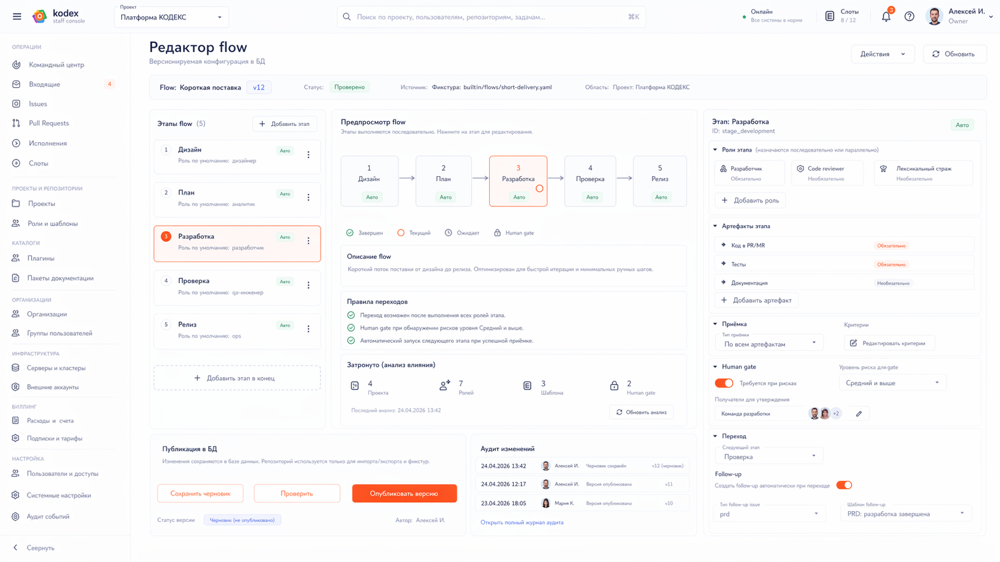
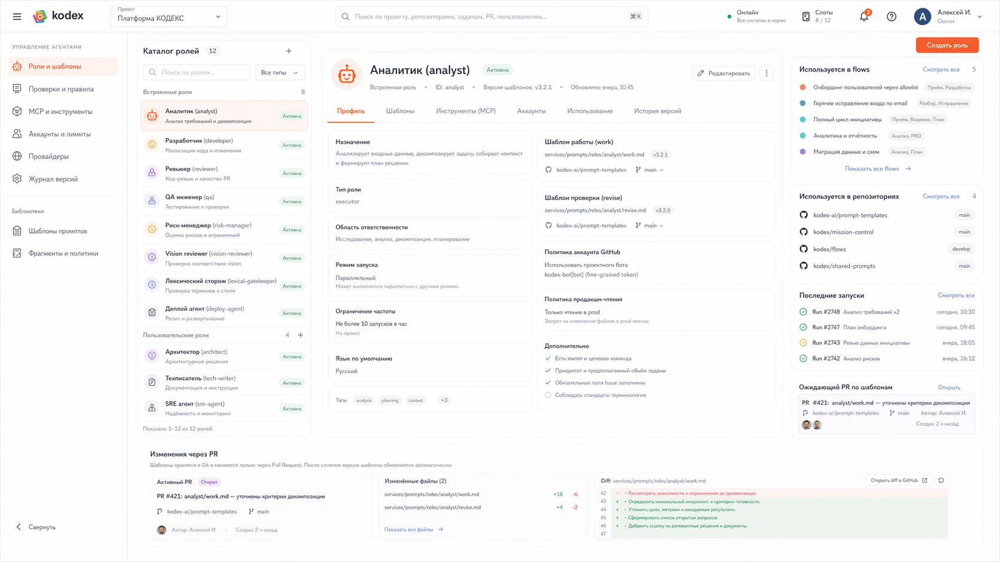
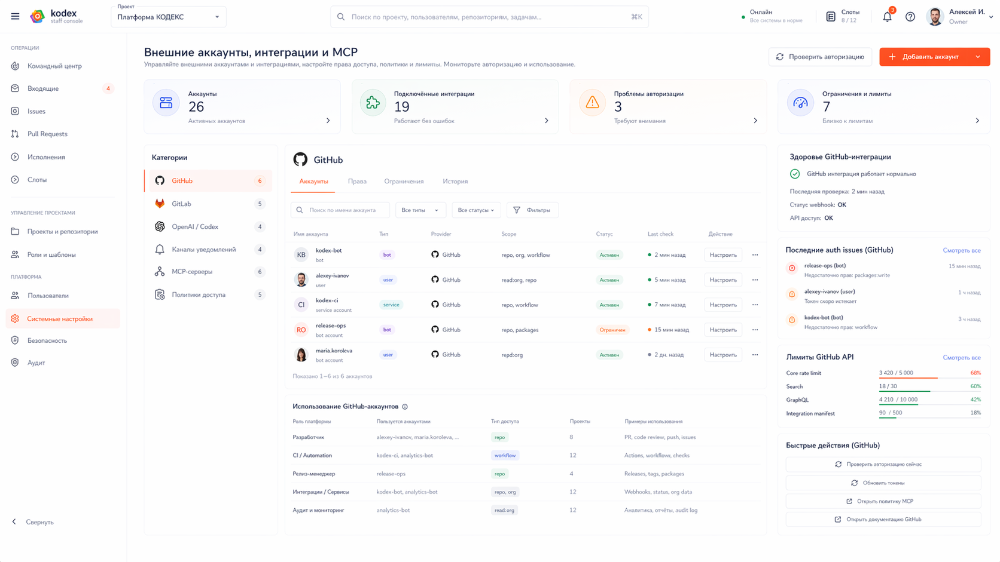
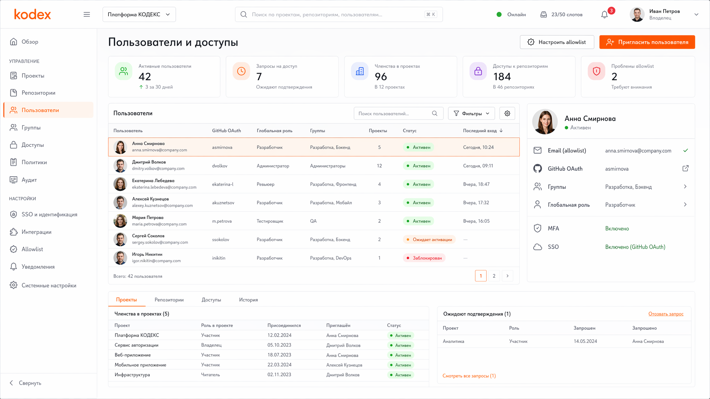

# UX редактирования flow, ролей, шаблонов промптов и настроек платформы

## TL;DR
- Канонический UX настройки строится не вокруг произвольного полотна, а вокруг последовательного редактирования сущностей с понятным предварительным просмотром.
- Flow редактируется как упорядоченная схема этапов, `stage role binding`, правил и Human gate, а графическое представление допускается только как вспомогательный просмотр.
- Роли и шаблоны промптов разделены: профиль роли, политика исполнения, flow и тексты шаблонов живут в БД платформы как версионируемая конфигурация.
- Редактор flow и каталог ролей — это не конкурирующие варианты одного экрана, а два разных канонических экрана настроечного контура.
- Пользовательские роли поддерживаются наравне со встроенными, но проходят тот же контур политик прав, MCP-доступов, аккаунтов и ревью.
- UI редактирует шаблоны, flow и ролевые политики через явное сохранение новой версии в БД с аудитом, policy-проверкой и возможностью отката.
- Wave 5.1 добавляет в настроечный контур каталоги пакетов, организации и группы, контур серверов и кластеров, billing, release policy и automation rules; эти разделы считаются обязательными даже до их полной детальной визуализации.

## 1. Почему нужен последовательный подход
Flow платформы — это не произвольный граф чего угодно.

В канонической модели flow состоит из:
- этапов;
- `stage role binding`;
- правил входа;
- обязательных артефактов;
- `gate` и Human gate;
- дополнительных ролей проверки;
- правил перехода;
- политики исполнения.

Такую модель надёжнее и понятнее редактировать как последовательность с инспектором правил, а не как свободно размещаемые ноды.

## 2. Канонический UX редактора flow

### 2.1. Главный режим
Основной редактор flow должен состоять из трёх связанных областей:
1. список этапов и переходов;
2. инспектор выбранного этапа или правила;
3. предварительный просмотр структуры потока.

Источник истины — список этапов и набор правил, а не расположение на полотне.

### 2.2. Что настраивается в этапе

| Блок | Что настраивается |
|---|---|
| Идентичность этапа | ключ этапа, название, описание, тип создаваемой задачи |
| Артефакты | нужен ли `PR/MR`, нужны ли структурированные комментарии |
| Приёмка | профиль приёмки, требования к watermark, обязательные проверки |
| Привязки ролей к этапу | кто исполняет этап, кто проверяет, кто работает как `gatekeeper`, кто подключается как вспомогательная роль |
| Human gate | где нужен человек и какой тип решения требуется |
| Runtime | `code-only`, `full-env`, reuse slot, production-read-only |
| Переход | следующий этап, ветвление, условия остановки, создание follow-up `Issue` и логика handover |

Для самого flow UI должен показывать источник и состояние версии:
- источник установочной фикстуры, если flow был загружен из seed-файла;
- активную версию;
- автора и время изменения;
- статус проверки;
- область применения: платформа, организация, команда или проект;
- кто может публиковать новую версию.

### 2.3. Просмотр потока
Графический просмотр допустим, но:
- не является единственным местом редактирования;
- строится автоматически;
- не зависит от ручного раскладывания нод;
- служит для понимания структуры, а не для ввода канонических данных.

### 2.4. Что запрещено в редакторе flow
Запрещено:
- делать свободное позиционирование источником истины;
- смешивать flow-логику с runtime-диагностикой;
- хранить необязательный визуальный шум вместо правил перехода.

### 2.5. Follow-up не дублируется в артефактах этапа
`Follow-up Issue` не считается артефактом текущего этапа.

Каноническое правило:
- блок `Артефакты этапа` описывает только результаты текущего этапа;
- блок `Переход` описывает создание следующей задачи и handover;
- Human gate остаётся отдельным блоком и не поглощает настройку follow-up.

Визуальный пакет редактора flow: [screen.md](images/wave5/03-flow-editor/screen.md).

## 3. Каталог ролей

### 3.1. Что должен показывать каталог ролей
Каталог ролей — это не список файлов шаблонов промптов, а реестр профилей ролей.

Он не должен смешиваться с редактором flow:
- flow отвечает за этапы и `stage role binding`;
- каталог ролей отвечает за профиль роли и её допустимые возможности;
- текст шаблонов промптов остаётся отдельным версионируемым объектом БД, связанным с ролью.

Для роли должны быть видны:
- имя роли;
- краткое описание;
- аватар, иконка или другой устойчивый визуальный маркер роли;
- встроенная или пользовательская;
- ключ роли;
- назначение;
- область действия;
- обязательный `work`-шаблон;
- необязательный `revise`-шаблон;
- режим исполнения;
- политика исполнения;
- MCP-права;
- внешние аккаунты;
- участие в flow.

Для каждой роли UI должен показывать версии шаблонов, статус проверки, область применения и источник установочной фикстуры, если роль была загружена из seed-файла. Это важно для разделения встроенных, организационных, командных и проектных ролей без runtime-зависимости от репозитория.

Канонические вкладки каталога ролей:
- `Профиль` — имя, описание, аватар/иконка, назначение, runtime и общая policy роли;
- `Шаблоны` — `work` и `revise`, тексты, версии и статус проверки;
- `Инструменты (MCP)` — допустимые инструменты и ограничения;
- `Аккаунты` — provider account policy;
- `Использование` — flows, проекты и репозитории;
- `История версий` — изменения профиля и шаблонов.

Визуальный пакет каталога ролей: [screen.md](images/wave5/04-role-catalog/screen.md).

### 3.2. Пользовательские роли
Пользователь должен иметь возможность:
- создать новую роль;
- привязать её к проекту, репозиторию или flow;
- назначить ей свои шаблоны;
- определить права к MCP, внешним аккаунтам и runtime;
- использовать её как исполнителя, роль проверки или контрольную роль.

Но такая роль не должна:
- обходить risk/release governance;
- обходить acceptance contract;
- получать неограниченный доступ к платформенным операциям без явной политики.

### 3.3. Встроенные роли
Встроенные роли редактируются не как скрытая системная магия, а как обычные профили платформы.

Пользователь с достаточными правами должен видеть:
- что роль встроенная;
- какие шаблоны и политики с ней связаны;
- какие поля можно менять, а какие зафиксированы ядром.

## 4. UX шаблонов промптов

### 4.1. Канонический принцип
Текст шаблона промпта хранится в БД платформы как версионируемый объект.

Следствия:
- БД является runtime-источником истины для текстов шаблонов;
- UI должен явно показывать, какая версия активна и кто её опубликовал;
- история изменений, проверки и откаты хранятся в платформе;
- разные организации и команды могут иметь разные версии и области применения без смешивания всех flow и ролей в одном месте;
- репозиторий платформы содержит только установочные фикстуры для начальной загрузки встроенных шаблонов.

### 4.2. Что должен уметь UI
UI должен:
- показать активную версию шаблона;
- показать, из какой установочной фикстуры он был создан, если такая связь есть;
- открыть редактирование шаблона;
- сформировать diff между версиями;
- провести policy-проверку;
- опубликовать новую версию в БД;
- связать новую версию с затронутыми ролями и flow.

### 4.3. Как выглядит редактирование
Канонический путь:
1. пользователь выбирает роль или flow;
2. открывает связанный `work` или `revise` шаблон;
3. редактирует текст или структурированные блоки;
4. UI показывает diff и затронутые связи;
5. платформа выполняет policy-проверку;
6. после сохранения новая версия становится доступной для запуска согласно области применения и правам.

### 4.4. Что хранится в БД
В БД допустимо хранить:
- текст шаблона;
- версию, digest и статус проверки;
- связь с установочной фикстурой, если шаблон загружен из seed-файла;
- связь с профилем роли;
- историю применения версии шаблона в `run`.

## 5. Настройка внешних аккаунтов, MCP и каналов

### 5.1. Каталог внешних аккаунтов
Настроечный UX должен явно различать:
- provider-аккаунты GitHub/GitLab;
- аккаунты моделей и Codex/OpenAI;
- аккаунты внешних каналов уведомлений и обратной связи;
- технические привязки аккаунтов к ролям и проектам.

Если в левой категории выбран конкретный provider, например GitHub, центральная поверхность и правая панель должны оставаться в provider-контексте.

Это означает:
- список аккаунтов, лимиты и auth issues относятся именно к GitHub;
- слой политик должен объяснять, как GitHub-аккаунты привязаны к ролям и проектам;
- общий экран MCP-серверов не должен смешиваться с provider-экраном и показывается в собственной категории.

Канонические вкладки provider-экрана:
- `Аккаунты` — реестр аккаунтов, их контуры использования, статусы и состояние авторизации;
- `Права` — слой политик: какие роли и проекты могут использовать какие provider-аккаунты и для каких операций;
- `Ограничения` — лимиты провайдера, auth restrictions, quotas и правила деградации;
- `История` — token rotation, auth failures, policy updates и другие значимые изменения.

Если активна вкладка `Права`, экран не должен одновременно показывать разделы реестра из вкладки `Аккаунты`.

Визуальный пакет внешних аккаунтов и интеграций: [screen.md](images/wave5/09-integrations-and-accounts/screen.md).

### 5.2. Права MCP и внешних операций
Для роли и flow должно быть видно не только какой шаблон промпта запустится, но и:
- какие MCP-инструменты доступны;
- какие операции требуют human gate;
- каким аккаунтом выполняются нативные для провайдера действия;
- в каком контуре это можно запускать.

### 5.3. Внешние каналы
UI должен проектироваться вокруг расширяемого контракта каналов, а не под один заранее фиксированный список.

На этом уровне пользователь должен понимать:
- какие каналы уже подключены;
- какие события в них уходят;
- кто получает уведомления;
- где требуются кнопки ответа, текст или голос.

## 6. Настройка доступа и публикация изменений

### 6.1. Кто может менять что
Консоль должна разделять права минимум на:
- просмотр;
- изменение рабочей конфигурации проекта;
- изменение flow;
- изменение профилей ролей;
- изменение текстов шаблонов;
- изменение внешних аккаунтов и каналов;
- изменение глобальных platform settings.

### 6.2. Публикация изменений

Если изменение затрагивает flow, профиль роли или шаблон промпта, UI публикует новую версию в БД после diff, policy-проверки и аудита.

Если изменение затрагивает проектный репозиторий, репозиторий проектной документации или репозиторий руководящего пакета, UI не должен сохранять его скрыто.

Канонический паттерн для репозиторного содержимого:
- изменить локальную форму или файл;
- показать diff и затронутые сущности;
- создать `PR/MR`;
- после слияния обновить проверенную проекцию.

### 6.3. Вкладки экрана пользователей и доступов
Экран пользователей и доступов использует вкладки внутри выбранного пользователя:
- `Проекты` — membership по проектам;
- `Репозитории` — доступ к отдельным репозиториям;
- `Доступы` — глобальная роль и ограничения;
- `История` — последние изменения прав и запросов доступа.

Эти вкладки не должны смешиваться с общей таблицей пользователей: таблица остаётся слоем реестра, а правая панель раскрывает выбранного пользователя.

Визуальный пакет пользователей и доступов: [screen.md](images/wave5/10-users-and-access/screen.md).

## 6.1. Настройка организаций и групп
Wave 5.1 фиксирует, что access UX не заканчивается списком пользователей.

Обязательные поверхности:
- реестр организаций;
- реестр глобальных и организационных групп;
- membership graph пользователя;
- inheritance и override-правила;
- права по контурам организаций, проектов, репозиториев, roles и packages.

Эти экраны детализируются в отдельном срезе wave 5.2 и уже входят в канонический настроечный контур.

## 6.2. Каталоги пакетов и установка пакетов
Настроечный UX обязан различать:
- каталог пакетов как слой реестра и каталогизации;
- карточку пакета;
- установку или импорт пакета;
- проверку версии и профиль риска;
- права, секреты пакета и формы описания возможностей;
- различие между `plugin package` и `guidance package`.

Канонические вкладки экрана пакета:
- `Плагины`;
- `Документация`;
- `Версии`;
- `Права и секреты`;
- `Установка`.

Визуальный пакет каталога пакетов: [screen.md](images/wave5/12-package-catalog/screen.md). Недостающие вкладки текущей итерации зафиксированы в [wave5-2-backlog.md](images/wave5/wave5-2-backlog.md).

## 6.3. Fleet, servers и clusters
Настроечный контур обязан поддерживать:
- реестр серверов;
- реестр Kubernetes-кластеров;
- placement policies;
- привязки организаций, проектов и packages к инфраструктурным контурам;
- health и capacity summaries.

Эти экраны не должны быть спрятаны внутри runtime-диагностики: контур серверов и кластеров — это отдельный слой политик и реестра.

## 6.4. Billing, release policy и automation rules
Wave 5.1 добавляет ещё три обязательных настроечных направления:
- `Billing и учёт` — записи затрат, распределение, основа для счёта, pricing;
- `Release policy` — branch rules, релизные линии, стратегии выкладки, release gates;
- `Automation rules` — cron, event triggers, bindings к flow и политика unattended запуска.

Эти сущности должны редактироваться не как свободные заметки, а как последовательные формы с preview влияния на проекты, роли и risk-gates.

## 7. Связь с рабочими поверхностями
Настроечный контур не должен быть изолированным бэк-офисом.

Из рабочего пространства `Issue/PR/MR` пользователь должен видеть:
- какой flow применён;
- какие роли участвовали;
- какие шаблоны использовались;
- какие политики повлияли на переход.

Из каталога flow и ролей пользователь должен иметь обратный переход:
- где это используется;
- какие проекты и репозитории зависят от конфигурации;
- какие `run` и `job` были выполнены с этой версией правил.

## 8. Текущие макеты настроечного контура

### 8.1. Редактор flow
Последовательный редактор flow остаётся каноническим экраном для настройки:
- этапов;
- `stage role binding`;
- acceptance profile;
- Human gate;
- переходов и follow-up как части перехода, а не артефактов этапа.

Спецификация экрана: [screen.md](images/wave5/03-flow-editor/screen.md)

### 8.2. Каталог ролей и шаблонов
Отдельный экран каталога ролей и шаблонов отвечает за:
- профиль роли;
- шаблоны `work` и `revise`;
- MCP-права;
- внешние аккаунты;
- использование роли в flow;
- публикацию новых версий в БД с аудитом и policy-проверкой.

Спецификация экрана: [screen.md](images/wave5/04-role-catalog/screen.md)

### 8.3. Внешние аккаунты, интеграции и MCP
Отдельный экран внешних аккаунтов и интеграций отвечает за:
- provider-аккаунты и их политики;
- лимиты и проблемы авторизации;
- использование provider-аккаунтов ролями и проектами;
- переход к отдельной категории MCP-серверов без смешения контекста;
- быстрые действия по проверке авторизации и открытию MCP-политик.

Для утверждённой модели этого экрана каноническим считается режим, где при выборе категории `GitHub` активная вкладка `Права` показывает именно слой политик, а реестр аккаунтов остаётся во вкладке `Аккаунты`.

Спецификация экрана: [screen.md](images/wave5/09-integrations-and-accounts/screen.md)

### 8.4. Пользователи и доступы
Отдельный экран пользователей и доступов отвечает за:
- список пользователей платформы;
- глобальные роли и project membership;
- доступ к отдельным репозиториям;
- ожидающие запросы доступа;
- связь с allowlist email и платформенным SSO/OIDC-контуром.

Спецификация экрана: [screen.md](images/wave5/10-users-and-access/screen.md)

## 9. Что deliberately не фиксируется в этой волне
В этой волне не фиксируются:
- точный формат editor widgets;
- полноценный визуальный редактор текстов шаблонов;
- финальная RBAC-матрица по полям конфигурации;
- точная структура установочных фикстур ролей и шаблонов в репозитории платформы.

Но обязательная каноника уже закреплена: последовательный редактор flow, каталог ролей с поддержкой встроенных и пользовательских ролей, тексты шаблонов в БД, версионирование через UI и установочные фикстуры в репозитории платформы.
