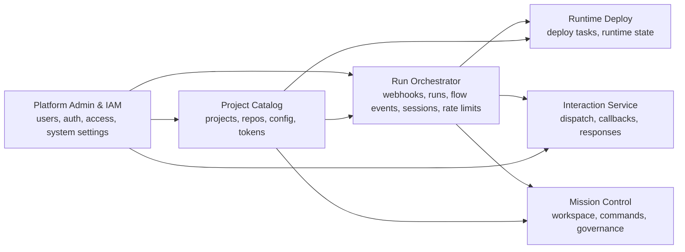

# Целевая архитектура

## Принцип

Новая архитектура должна быть не "много маленьких процессов ради процессов", а набором доменных сервисов с ясным ownership.

Предлагаемая целевая модель - 6 сервисов:
- Platform Admin & IAM Service
- Project Catalog Service
- Run Orchestrator Service
- Runtime Deploy Service
- Interaction Service
- Mission Control Service

В этой модели:
- GitHub rate limit не выделяется в отдельный сервис, а входит в Run Orchestrator Service как часть lifecycle run;
- Change Governance не выделяется в отдельный сервис на первом целевом шаге, а входит в Mission Control Service как связанный read/projection context;
- system settings входят в Platform Admin & IAM Service, если не будет выявлен отдельный устойчивый domain boundary.

## Диаграмма

## Почему именно так

### 1. Platform Admin & IAM Service

Нужен отдельный владелец для:
- пользователей;
- staff auth;
- OAuth и access rules;
- системных настроек платформы.

Это административный и security boundary. Его нельзя размазывать по другим сервисам.

### 2. Project Catalog Service

В одном месте должны жить:
- проекты;
- репозитории;
- конфигурация проекта и репозитория;
- секреты и токены интеграций;
- metadata для webhook и preflight.

Это сервис каталога и конфигурации платформы.

### 3. Run Orchestrator Service

Это главный владелец жизненного цикла run:
- webhook ingest;
- создание run;
- flow events;
- agent sessions;
- wait states;
- GitHub rate limit waits и resume semantics;
- runtime errors, если они привязаны к run lifecycle.

### 4. Runtime Deploy Service

Отдельный тяжелый operational контур:
- lease queue;
- prepare environment;
- runtime reuse;
- deploy/cancel/stop;
- взаимодействие с Kubernetes и registry.

### 5. Interaction Service

Отдельный stateful workflow:
- dispatch;
- callback handling;
- delivery attempts;
- timeout/expiry;
- adapters вроде Telegram.

### 6. Mission Control Service

Это отдельный read-heavy и command-heavy контекст:
- graph/workspace/timeline;
- команды и leases;
- governance projections и решения.

## Что должно исчезнуть

После завершения программы рефакторинга не должно остаться старого Control Plane как доменного ядра. Допустимы только два исхода:

### Предпочтительный исход

`services/internal/control-plane` удален полностью, а его обязанности распределены между сервисами.

### Допустимый промежуточный исход

Старый Control Plane превращен в тонкий edge adapter без доменной логики:
- прием внешнего трафика;
- auth middleware;
- request routing;
- zero business logic;
- zero direct ownership над данными.

Но этот промежуточный исход не должен становиться новой стабильной архитектурой.
